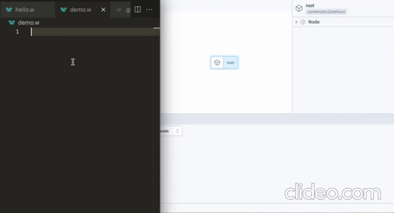

# Welcome to the Wing Language! :wave:

<p align="left">
  <a href="https://docs.winglang.io/getting-started">Quick Start</a>
  ▪︎
  <a href="http://t.winglang.io/slack">Join Slack</a>
  ▪︎
  <a href="https://docs.winglang.io">Docs</a>
  ▪︎
  <a href="https://docs.winglang.io/category/faq">FAQ</a>
  ▪︎
  <a href="https://docs.winglang.io/status#roadmap">Roadmap</a>
  ▪︎
  <a href="https://github.com/winglang/wing/issues">Issues</a>
  ▪︎
  <a href="https://github.com/winglang/wing/discussions">Discussions</a>
  ▪︎
  <a href="https://docs.winglang.io/contributors/">Contribute</a>
</p>

**Winglang** is a new open-source programming language designed for the cloud (aka "*cloud-oriented*"). Wing enables developers to build distributed systems that leverage cloud services as first-class citizens by combining infrastructure ***and*** code.
Wing programs can be executed locally (*yes, no internet required*) using a fully-functional simulator, or deployed to any cloud provider (*yes, Wing programs are portable across providers*).

Our mission is to bring back your creative flow and close the gap between imagination and creation. Wing elevates your cloud development experience to new heights (the puns are just inevitable so bear with us)! 🚀

<a href="https://youtu.be/vHy1TM2JzUQ" target="_blank" align="left">
    
</a>

Wing is built by [Elad Ben-Israel](https://github.com/eladb), the guy behind the [AWS CDK](https://github.com/aws/aws-cdk), the gang at [Monada](https://monada.co) and an amazing [community](https://t.winglang.io/slack) of contributors (also known as Wingnuts).

## Why do we think the cloud needs a programming language? 🤔

Existing languages are unable to express the distributed and infrastructure-heavy nature of cloud 
applications, which are fundamentally different from applications that run on a single machine. 
They are distributed systems which rely on cloud infrastructure to achieve their goals. The primary
motivation for a new language is to allow developers to express both cloud infrastructure *and*
application logic through a unified programming model.

To allow Winglang code to express both infrastructure and application, the language introduces the concept of *execution phases*. 
The "preflight" phase is where you define your cloud infrastructure and the "inflight" phase is where you define your application logic.
Preflight code is executed *during compilation* and produces the infrastructure configuration for your app (e.g. **Terraform**, **CloudFormation**, etc).
Inflight code is compiled to **JavaScript** and executed on within cloud compute platforms in Node.js environments.

Let's look at a simple example:

```js
bring cloud;

let queue = new cloud.Queue();
let counter = new cloud.Counter();
let bucket = new cloud.Bucket();

queue.add_consumer(inflight (message: str) => {
  let i = counter.inc();
  bucket.put("file-${i}.txt", message);
});
```

The `cloud.Queue`, `cloud.Counter` and `cloud.Bucket` are *preflight objects*. They represent
cloud infrastructure resources. When compiled to a specific cloud provider, such as AWS, a Terraform file will be produced with the provider's implementation
of these resources.

The `queue.add_consumer()` method is a *preflight method* that configures the infrastructure to
invoke a particular *inflight function* for each message in the queue.

Now comes the cool part: the code that runs inside the inflight function interacts with the `counter` and the `bucket` objects
through the *inflight methods* of these objects (`counter.inc()` and `bucket.put()`). These methods can only be
called from inflight scopes. In existing languages, where there is no way to distinguish between multiple execution phases,
it is impossible to naturally represent this idea that an object has methods that can only be executed from within a specific
execution phase in a type-safe manner.

> ### Note for cloud experts 🤓
>
> To give full control over how applications are deployed, Wing lets you customize **operational details** in a few ways:
>
> 1. by creating a [compiler plugin](https://docs.winglang.io/reference/compiler-plugins) that modifies the generated Terraform, or 
> 2. by providing implementations of built-in resources like `cloud.Bucket`, or
> 3. by developing your own custom resources.
>
> This layer of separation allows you to refactor code and write unit tests that focus on the business logic, while still having the flexibility to make changes under the hood.

## What makes Wing a good fit for cloud development? 🌟

Wing was built from the ground up to make it an ideal choice for building applications on any cloud.
It includes an assembly of different features that serve that purpose:

* [Cloud services](https://docs.winglang.io/concepts/resources) as first-class citizens, with [phase modifiers](https://docs.winglang.io/reference/spec#13-phase-modifiers) for config or runtime (`preflight` and `inflight`).
* Higher level of cloud abstraction with a [standard library](https://docs.winglang.io/reference/wingsdk-spec).
* [Distributed computing primitives](https://docs.winglang.io/concepts/inflights).
* [Compiler plugins](https://docs.winglang.io/reference/compiler-plugins) that can be used to customize the compilation output, such as infrastructure definitions.
* [JavaScript interoperability](https://docs.winglang.io/reference/spec#5-interoperability).
* Automatic generation of IAM policies and other cloud mechanics based on intent.
* [Native JSON](https://docs.winglang.io/reference/spec#114-json-type) and schema validation support.
* [Default immutability](https://docs.winglang.io/blog/2023/02/02/good-cognitive-friction#immutable-by-default).
* [Implicit async](https://docs.winglang.io/reference/spec#113-asynchronous-model), explicit defer.

For a more in-depth look at Wing's features and benefits, check out our [documentation](https://docs.winglang.io/).

## Getting started 🛠️

> 🚧 Wing is still in alpha, and not recommended for production use. But we're excited for anyone to take part in shaping our 
> roadmap and contributing in any way. Our [project status](https://docs.winglang.io/status) page includes more information about 
> stability and roadmap.

You can install Wing in a few simple steps:

1. Check out the [Prerequisites](https://docs.winglang.io/getting-started/installation#prerequisites).
2. Install the [Wing CLI](https://docs.winglang.io/getting-started/installation#wing-cli).
3. Get the [Wing IDE Extension](https://docs.winglang.io/getting-started/installation#wing-ide-extension) for your favorite editor.
4. Launch the [Wing Console](https://docs.winglang.io/getting-started/installation#wing-console) and take it for a spin!

For a step-by-step guide, head over to our [Getting Started](https://docs.winglang.io/getting-started) guide.
It's a once-in-a-lifetime adventure into the Wing rabbit hole!

## FAQs ❓

Here are some questions we're commonly asked that are covered by our [FAQ](https://docs.winglang.io/faq):

* [Who is behind this project?](https://docs.winglang.io/faq/who-is-behind-wing)
* [Which clouds are supported by Wing?](https://docs.winglang.io/faq/supported-clouds)
* [Which provisioning engines are supported by Wing?](https://docs.winglang.io/faq/supported-provisioning-engines)

## Community 💬

Join our flock in the [Wing Slack](https://t.winglang.io/slack) community.
We're here to help each other, answer questions, and share our cloud adventures.
Alternatively, post any questions on [GitHub Discussions](https://github.com/winglang/wing/discussions).

## Contributing 🤝

Want to help Wing take flight?
Check out our [contribution guide](https://github.com/winglang/wing/blob/main/CONTRIBUTING.md) to learn how to set up a development environment and contribute to the project.
We appreciate your support and look forward to learning and building together.

We are incredibly grateful to our entire community for contributing bug fixes and improvements:

<a href="https://github.com/winglang/wing/graphs/contributors">
  
</a>

## License 📜

Wing is licensed under the  [MIT License](./LICENSE.md).
Contributions are made under our [contribution license](https://docs.winglang.io/terms-and-policies/contribution-license.html).

Happy coding, and remember: the sky's the limit with Wing (yes, another pun)! 🌤️🚀

[wing slack]: https://t.winglang.io/slack
