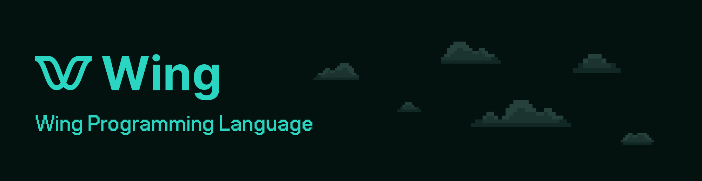

<p align="center">
  &nbsp;
  <a href="https://docs.winglang.io/getting-started">Quick Start</a>
  ▪︎
  <a href="http://t.winglang.io/slack">Slack</a>
  ▪︎
  <a href="https://docs.winglang.io">Docs</a>
  ▪︎
  <a href="https://docs.winglang.io/status#roadmap">Roadmap</a>
  ▪︎
  <a href="https://docs.winglang.io/getting-started">Getting Started</a>
  ▪︎
  <a href="https://github.com/winglang/wing/issues">Issues</a>
  ▪︎
  <a href="https://github.com/winglang/wing/discussions">Discussions</a>
  ▪︎
  <a href="https://stackoverflow.com/questions/tagged/winglang">Stack Overflow</a>
  ▪︎
  <a href="https://docs.winglang.io/contributors/handbook">Contribute</a>
</p>

# Welcome! :wave:

**Wing** is a [cloud-oriented programming language]. It is a modern,
object-oriented, and strongly-typed language. Most programming languages think
about computers as machines. In Wing, **_the cloud is the computer_**.

Wing applications compile to Terraform and JavaScript that are ready to deploy
to your favorite cloud provider, and can also be tested in your local
environment using the [Wing Console](https://docs.winglang.io/getting-started/console).

[cloud-oriented programming language]: https://docs.winglang.io/#what-is-a-cloud-oriented-language

```js
bring cloud;

let bucket = new cloud.Bucket();

new cloud.Function(inflight (event: str): str => {
  bucket.put("greeting.txt", "hello, world!");
});
```

## This is Alpha

Wing is in its very early stages of development and not recommended for
production use. Many features are still missing, and APIs will dramatically
evolve in the coming months. We are excited for anyone to take part in
influencing the direction of every part of this project.

Our <a href="https://docs.winglang.io/status">Project Status</a> page includes
more information about stability and roadmap 👷‍♀️

## Installation

- [Prerequisites](https://docs.winglang.io/getting-started/installation#prerequisites)
- [Wing CLI](https://docs.winglang.io/getting-started/installation#wing-cli)
- [Wing IDE Extension](https://docs.winglang.io/getting-started/installation#wing-ide-extension)
- [Wing Console](https://docs.winglang.io/getting-started/installation#wing-console)

## Getting Started

The [Getting Started](https://docs.winglang.io/getting-started) guide is a
once-in-a-lifetime adventure into the Wing rabbit hole.

To learn more about Wing concepts such as
[resources](https://docs.winglang.io/concepts/resources) and
[inflights](https://docs.winglang.io/concepts/inflights), jump over to the
[Concepts](https://docs.winglang.io/category/concepts) section in our docs.

For a comprehensive reference of the language, check out the [Wing Language
Specification](https://docs.winglang.io/reference/spec) and the [API
Reference](https://docs.winglang.io/reference/sdk).

## Community

We all hang out on [Wing Slack]. Come as you are, say hi, ask questions, help
friends, geek out! Alternatively, post any question you have on [GitHub
Discussions](https://github.com/winglang/wing/discussions).

## Contributing

We welcome and celebrate contributions from the community! Please see our
[contribution guide](./CONTRIBUTING.md) for more information about setting up a
development environment, what we are working on, where we need help and other
guidelines for contributing to the project.

We are also actively tracking planned features in our roadmap:

- [Wing Language Roadmap](https://github.com/orgs/winglang/projects/1/views/1)
- [Wing SDK Roadmap](https://github.com/orgs/winglang/projects/3/views/1)

## Contributors

<!-- ALL-CONTRIBUTORS-LIST:START - Do not remove or modify this section -->
<!-- prettier-ignore-start -->
<!-- markdownlint-disable -->
<table>
  <tbody>
    <tr>
      <td align="center" valign="top" width="14.28%"><a href="https://www.linkedin.com/in/mark-mcculloh/"><br /><sub><b>Mark McCulloh</b></sub></a><br /><a href="https://github.com/winglang/wing/commits?author=MarkMcCulloh" title="Code">💻</a></td>
      <td align="center" valign="top" width="14.28%"><a href="https://rybicki.io/"><br /><sub><b>Chris Rybicki</b></sub></a><br /><a href="https://github.com/winglang/wing/commits?author=Chriscbr" title="Code">💻</a></td>
      <td align="center" valign="top" width="14.28%"><a href="https://github.com/eladb"><br /><sub><b>Elad Ben-Israel</b></sub></a><br /><a href="https://github.com/winglang/wing/commits?author=eladb" title="Code">💻</a></td>
      <td align="center" valign="top" width="14.28%"><a href="https://github.com/staycoolcall911"><br /><sub><b>Uri Bar</b></sub></a><br /><a href="https://github.com/winglang/wing/commits?author=staycoolcall911" title="Code">💻</a></td>
      <td align="center" valign="top" width="14.28%"><a href="https://github.com/yoav-steinberg"><br /><sub><b>yoav-steinberg</b></sub></a><br /><a href="https://github.com/winglang/wing/commits?author=yoav-steinberg" title="Code">💻</a></td>
      <td align="center" valign="top" width="14.28%"><a href="https://sepehrlaal.com/"><br /><sub><b>Sepehr Laal</b></sub></a><br /><a href="https://github.com/winglang/wing/commits?author=3p3r" title="Code">💻</a></td>
      <td align="center" valign="top" width="14.28%"><a href="https://winglang.io/"><br /><sub><b>Eyal Keren</b></sub></a><br /><a href="https://github.com/winglang/wing/commits?author=ekeren" title="Code">💻</a></td>
    </tr>
    <tr>
      <td align="center" valign="top" width="14.28%"><a href="https://pallares.io/"><br /><sub><b>Cristian Pallarés</b></sub></a><br /><a href="https://github.com/winglang/wing/commits?author=skyrpex" title="Code">💻</a></td>
      <td align="center" valign="top" width="14.28%"><a href="https://github.com/ainvoner"><br /><sub><b>Ainvoner</b></sub></a><br /><a href="https://github.com/winglang/wing/commits?author=ainvoner" title="Code">💻</a></td>
      <td align="center" valign="top" width="14.28%"><a href="https://github.com/hasanaburayyan"><br /><sub><b>Hasan</b></sub></a><br /><a href="https://github.com/winglang/wing/commits?author=hasanaburayyan" title="Code">💻</a></td>
      <td align="center" valign="top" width="14.28%"><a href="https://github.com/shaiber01"><br /><sub><b>shaiber01</b></sub></a><br /><a href="https://github.com/winglang/wing/commits?author=shaiber01" title="Code">💻</a></td>
      <td align="center" valign="top" width="14.28%"><a href="https://www.matthewbonig.com/"><br /><sub><b>Matthew Bonig</b></sub></a><br /><a href="https://github.com/winglang/wing/commits?author=mbonig" title="Code">💻</a></td>
      <td align="center" valign="top" width="14.28%"><a href="https://github.com/eladb2"><br /><sub><b>eladb2</b></sub></a><br /><a href="https://github.com/winglang/wing/commits?author=eladb2" title="Code">💻</a></td>
      <td align="center" valign="top" width="14.28%"><a href="https://github.com/joao-zanutto"><br /><sub><b>Joao Pedro Zanutto</b></sub></a><br /><a href="https://github.com/winglang/wing/commits?author=joao-zanutto" title="Code">💻</a></td>
    </tr>
    <tr>
      <td align="center" valign="top" width="14.28%"><a href="https://github.com/yamatatsu"><br /><sub><b>Tatsuya Yamamoto</b></sub></a><br /><a href="https://github.com/winglang/wing/commits?author=yamatatsu" title="Code">💻</a></td>
      <td align="center" valign="top" width="14.28%"><a href="https://github.com/polamoros"><br /><sub><b>polamoros</b></sub></a><br /><a href="https://github.com/winglang/wing/commits?author=polamoros" title="Code">💻</a></td>
      <td align="center" valign="top" width="14.28%"><a href="https://github.com/revitalbarletz"><br /><sub><b>Revital Barletz</b></sub></a><br /><a href="https://github.com/winglang/wing/commits?author=revitalbarletz" title="Code">💻</a></td>
      <td align="center" valign="top" width="14.28%"><a href="https://winglang.io/"><br /><sub><b>Shai Ber</b></sub></a><br /><a href="https://github.com/winglang/wing/commits?author=ShaiBer" title="Code">💻</a></td>
      <td align="center" valign="top" width="14.28%"><a href="http://endoflineblog.com/"><br /><sub><b>Adam Ruka</b></sub></a><br /><a href="https://github.com/winglang/wing/commits?author=skinny85" title="Code">💻</a></td>
      <td align="center" valign="top" width="14.28%"><a href="https://github.com/WeepingClown13"><br /><sub><b>Ananthu C V</b></sub></a><br /><a href="https://github.com/winglang/wing/commits?author=WeepingClown13" title="Code">💻</a></td>
      <td align="center" valign="top" width="14.28%"><a href="https://github.com/Oreoxmt"><br /><sub><b>Aolin</b></sub></a><br /><a href="https://github.com/winglang/wing/commits?author=Oreoxmt" title="Code">💻</a></td>
    </tr>
    <tr>
      <td align="center" valign="top" width="14.28%"><a href="https://github.com/schosterbarak"><br /><sub><b>Barak Schoster Goihman</b></sub></a><br /><a href="https://github.com/winglang/wing/commits?author=schosterbarak" title="Code">💻</a></td>
      <td align="center" valign="top" width="14.28%"><a href="https://github.com/flyingImer"><br /><sub><b>EJ Wang</b></sub></a><br /><a href="https://github.com/winglang/wing/commits?author=flyingImer" title="Code">💻</a></td>
      <td align="center" valign="top" width="14.28%"><a href="https://github.com/Eitansl"><br /><sub><b>Eitan Segel-Lion</b></sub></a><br /><a href="https://github.com/winglang/wing/commits?author=Eitansl" title="Code">💻</a></td>
      <td align="center" valign="top" width="14.28%"><a href="http://linkedin.com/singledigit"><br /><sub><b>Eric Johnson</b></sub></a><br /><a href="https://github.com/winglang/wing/commits?author=singledigit" title="Code">💻</a></td>
      <td align="center" valign="top" width="14.28%"><a href="https://github.com/jogold"><br /><sub><b>Jonathan Goldwasser</b></sub></a><br /><a href="https://github.com/winglang/wing/commits?author=jogold" title="Code">💻</a></td>
      <td align="center" valign="top" width="14.28%"><a href="https://github.com/raywonkari"><br /><sub><b>Raywon Kari</b></sub></a><br /><a href="https://github.com/winglang/wing/commits?author=raywonkari" title="Code">💻</a></td>
      <td align="center" valign="top" width="14.28%"><a href="https://rjourdan.com/"><br /><sub><b>Romain Jourdan</b></sub></a><br /><a href="https://github.com/winglang/wing/commits?author=rjourdan" title="Code">💻</a></td>
    </tr>
    <tr>
      <td align="center" valign="top" width="14.28%"><a href="https://github.com/VictorEB"><br /><sub><b>Victor</b></sub></a><br /><a href="https://github.com/winglang/wing/commits?author=VictorEB" title="Code">💻</a></td>
      <td align="center" valign="top" width="14.28%"><a href="https://godspeed.run/"><br /><sub><b>perpil</b></sub></a><br /><a href="https://github.com/winglang/wing/commits?author=perpil" title="Code">💻</a></td>
      <td align="center" valign="top" width="14.28%"><a href="https://blog.sebbel.net/"><br /><sub><b>sebbel</b></sub></a><br /><a href="https://github.com/winglang/wing/commits?author=sebbel" title="Code">💻</a></td>
      <td align="center" valign="top" width="14.28%"><a href="https://github.com/tsuf239"><br /><sub><b>tsuf239</b></sub></a><br /><a href="https://github.com/winglang/wing/commits?author=tsuf239" title="Code">💻</a></td>
      <td align="center" valign="top" width="14.28%"><a href="https://github.com/Warkanlock"><br /><sub><b>txxnano</b></sub></a><br /><a href="https://github.com/winglang/wing/commits?author=Warkanlock" title="Code">💻</a></td>
      <td align="center" valign="top" width="14.28%"><a href="https://github.com/Joshswooft"><br /><sub><b>Josh</b></sub></a><br /><a href="https://github.com/winglang/wing/commits?author=Joshswooft" title="Documentation">📖</a></td>
      <td align="center" valign="top" width="14.28%"><a href="https://github.com/marciocadev"><br /><sub><b>Marcio Cruz de Almeida</b></sub></a><br /><a href="https://github.com/winglang/wing/commits?author=marciocadev" title="Code">💻</a></td>
    </tr>
    <tr>
      <td align="center" valign="top" width="14.28%"><a href="http://itaikeren.com"><br /><sub><b>Itai Keren</b></sub></a><br /><a href="#tool-itaikeren" title="Tools">🔧</a></td>
    </tr>
  </tbody>
  <tfoot>
    <tr>
      <td align="center" size="13px" colspan="7">
        
          <a href="https://all-contributors.js.org/docs/en/bot/usage">Add your contributions</a>
        </img>
      </td>
    </tr>
  </tfoot>
</table>

<!-- markdownlint-restore -->
<!-- prettier-ignore-end -->

<!-- ALL-CONTRIBUTORS-LIST:END -->

## License

This project is licensed under the [MIT License](./LICENSE.md). Contributions are made under our [contribution license](https://docs.winglang.io/terms-and-policies/contribution-license.html).

[wing slack]: https://t.winglang.io/slack
