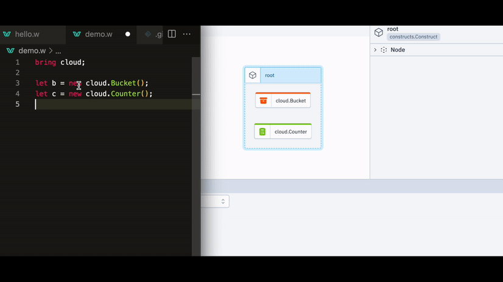

<p align="center">
  <a href="https://docs.winglang.io/getting-started">Quick Start</a> •
  <a href="http://t.winglang.io/slack">Slack</a> •
  <a href="https://docs.winglang.io">Docs</a> •
  <a href="https://docs.winglang.io/status#roadmap">Roadmap</a> •
  <a href="https://docs.winglang.io/getting-started">Getting Started</a> •
  <a href="https://github.com/winglang/wing/issues">Issues</a> •
  <a href="https://github.com/winglang/wing/discussions">Discussions</a> •
  <a href="https://stackoverflow.com/questions/tagged/winglang">Stack Overflow</a> •
  <a href="https://docs.winglang.io/contributors/">Contribute</a>
</p>

[](https://youtu.be/x0xfIoY5y6E)

# Welcome! :wave:

**Wing** is an open-source, statically-typed, [cloud-oriented programming language]. 
It has [distributed computing primitives], a [resource system] that represents cloud services with their 2 different phases (configuration & runtime), and [other optimizations for cloud programming].

[](https://youtu.be/y7OGRC2f5gk)

## Compilation to Terraform and Javascript
Wing applications compile to Terraform and JavaScript that are ready to deploy
to your favorite cloud provider. Support for more provisioning engines and clouds is planned.
Wing's [compiler plugins] can be used to customize the compilation output. For example, make all buckets that are exposed to the internet encrypted.

[](https://youtu.be/gr4ewOJGkfo)

## Local simuation
Wing provides a built-in local simulator, and an observability & debugging [console] for easy testing and fast iteration loops.

[](https://youtu.be/Gqn1hYPEwqg)

## Cloud abstraction
While most programming languages think about computers as machines, in Wing, **_the cloud is the computer_**.
Similar to how traditional languages abstract the computer, wing abstarcts the cloud with a [standard library] of the basic cloud services. The Wing compiler uses a dependency injection mechanism to convert these abstract services into the configured ones for each target cloud. It is possible to create and use external libraries too, including import of any Terraform resource.

```js
// This line imports the standard library.
bring cloud;

// We are instantiating an abstract bucket here.
// At compile time, it will be substituted by the configured implementation for the target cloud.
let bucket = new cloud.Bucket();
```

Since the Wing compiler sees the entire application, including its infrastrucrure, it can also generate least privilege IAM policies based on intent, and other cloud mechanics.

```js
bring cloud;

// This code runs at compile time to provision the bucket.
let bucket = new cloud.Bucket();

// This code runs at compile time to provision the function.
new cloud.Function(inflight () => {
  // This code runs later, on other machines, and interacts with the provisioned bucket.
  // The compiler knows to generate the network topology and IAM policies needed for the function to be able to put
  // a file in the bucket. It also knows to capture the bucket at deployment time and pass the info that is needed
  // for the function to interact with it at runtime.
  bucket.put("hello.txt", "World!");
});
```

## Wing's creator
While there are many developers [contributing](#contributors) to the project, it started with the vision of [Elad Ben-Israel], who is also the creator of the [AWS CDK].

[cloud-oriented programming language]: https://docs.winglang.io/#what-is-a-cloud-oriented-language
[distributed computing primitives]: https://docs.winglang.io/concepts/inflights
[resource system]: https://docs.winglang.io/concepts/resources
[other optimizations for cloud programming]: #main-features-that-make-wing-tailored-for-cloud-development
[compiler plugins]: https://docs.winglang.io/reference/compiler-plugins
[Elad Ben-Israel]: https://github.com/eladb
[AWS CDK]: https://github.com/aws/aws-cdk
[console]: https://docs.winglang.io/getting-started/console
[Standard library]: https://docs.winglang.io/reference/wingsdk-spec

## This is Alpha

Wing is in its very early stages of development and not recommended for
production use. Many features are still missing, and APIs will dramatically
evolve in the coming months. We are excited for anyone to take part in
influencing the direction of every part of this project.

Our <a href="https://docs.winglang.io/status">Project Status</a> page includes
more information about stability and roadmap 👷‍♀️

## Why a language? (and not a library or platform)
We believe that the cloud is a new kind of computer that requires a [new programming paradigm](https://docs.winglang.io/#what-is-a-cloud-oriented-language) to fully utilize it.

While it is possible to use this new paradigm with existing languages, we believe that a language that natively supports it will take it to the next level, in a way that is impossible to accomplish with existing ones.

`Inflight` functions and resources are a great example. We believe it is impossible to ensure this level of isolation and interaction semantics in existing languages through a library, or even through a compiler extension. We've seen some worthy efforts in projects like [Pulumi's Function Serialization](https://www.pulumi.com/docs/intro/concepts/function-serialization/) and [Functionless](https://functionless.org/), and in all of these cases, there are either compromises in safety (e.g. it is possible to capture mutable objects) or in the programming model (e.g. type system is too complex).

With Wing, we believe we can provide a very elegant solution for both.
As seen below, Wing has phase modifiers that are understood by the language server, which allows it to suggest different completion options for the same object, based on the execution phase from which is it accessed.

[](https://youtu.be/y7OGRC2f5gk)

As can be seen in the below section, creating a new language that is tailored to the cloud from the ground up also allows us to assemble a variety of features (some of which exist in other languages, of course) that, when put together, offer a delightful cloud development experience.

## Main features that make Wing tailored for cloud development
1. [Cloud services](https://docs.winglang.io/concepts/resources) are first-class citizens.
    - They have [phase modifiers](https://docs.winglang.io/reference/spec#13-phase-modifiers) with different interfaces for config or runtime (`preflight` and `inflight`).
2. Higher level of cloud abstraction.
    - [Standard library](https://docs.winglang.io/reference/wingsdk-spec) that abstracts main cloud services.
    - Built-in dependency injection system that resolves services to specific clouds at compile time.
3. [Distributed computing primitives](https://docs.winglang.io/concepts/inflights).
    - [Default immutability](https://docs.winglang.io/blog/2023/02/02/good-cognitive-friction#immutable-by-default).
    - [Implicit async](https://docs.winglang.io/reference/spec#113-asynchronous-model), explicit defer.
4. [Compiler plugins](https://docs.winglang.io/reference/compiler-plugins) that can be used to customize the compilation output, such as infrastructure definitions.
5. [JavaScript interoperability](https://docs.winglang.io/reference/spec#5-interoperability).
6. Automatic generation of IAM policies and other cloud mechanics based on intent.
7. [Native JSON support](https://docs.winglang.io/reference/spec#114-json-type).
8. More in the [spec](https://docs.winglang.io/reference/spec).

## What does the development flow look like with Wing
1. Write code that targets an abstract cloud.
2. Visualize, test, and interact with it using the Wing console and its instant hot reloading.
3. Compile to JS and Terraform, targeting the desired cloud and provisioning engine.
4. Deploy and manage with your existing tools.

[](https://youtu.be/x0xfIoY5y6E)

## Is there a company behind Wing / what is the business model
[Monada](https://monada.co) is leading the development of Winglang.
The language and local simulator will always remain open-source and free to use, with plans to eventually contribute them to a dedicated foundation.
Monada's business model is planned around connecting the Wing console to production applications and charging for the enhanced management and observability experience it will provide. Use of the console for development will always remain free.

By choosing this approach, Monada aligns its interests with those of the community, incentivizing itself to actively support the Wing ecosystem. As Wing usage increases, it creates a potential user base for the production console's monetizable management and observability features, which are reliant on the managed app's code being written in Wing.

Since Wing is compiled to Javascript and Terraform, developers will always be able to continue to use their existing management and observability solutions with it. We believe that because the Wing compiler sees the "entire picture" of the application, a management console that taps into that knowledge can offer very competitive features. As the compiler is open-source, other companies will be able to offer competing consoles with the same features.

## Why you should consider Wing
[Details here.](https://docs.winglang.io/#why-you-should-consider-wing)

## Installation

- [Prerequisites](https://docs.winglang.io/getting-started/installation#prerequisites)
- [Wing CLI](https://docs.winglang.io/getting-started/installation#wing-cli)
- [Wing IDE Extension](https://docs.winglang.io/getting-started/installation#wing-ide-extension)
- [Wing Console](https://docs.winglang.io/getting-started/installation#wing-console)

## Getting Started

The [Getting Started](https://docs.winglang.io/getting-started) guide is a
once-in-a-lifetime adventure into the Wing rabbit hole.

To learn more about Wing concepts such as
[resources](https://docs.winglang.io/concepts/resources) and
[inflights](https://docs.winglang.io/concepts/inflights), jump over to the
[Concepts](https://docs.winglang.io/category/concepts) section in our docs.

For a comprehensive reference of the language, check out the [Wing Language
Specification](https://docs.winglang.io/reference/spec) and the [API
Reference](https://docs.winglang.io/reference/sdk).

## Community

We all hang out on [Wing Slack]. Come as you are, say hi, ask questions, help
friends, geek out! Alternatively, post any question you have on [GitHub
Discussions](https://github.com/winglang/wing/discussions).

## Contributing

We welcome and celebrate contributions from the community! Please see our [contribution
guide](https://github.com/winglang/wing/blob/main/CONTRIBUTING.md) for more information about
setting up a development environment, what we are working on, where we need help and other
guidelines for contributing to the project.

We are also actively tracking planned features in our roadmap:

- [Wing Language Roadmap](https://github.com/orgs/winglang/projects/1/views/1)
- [Wing SDK Roadmap](https://github.com/orgs/winglang/projects/3/views/1)

## Contributors

<a href="https://github.com/winglang/wing/graphs/contributors">
  
</a>

## License

This project is licensed under the [MIT License](./LICENSE.md). Contributions are made under our [contribution license](https://docs.winglang.io/terms-and-policies/contribution-license.html).

[wing slack]: https://t.winglang.io/slack
