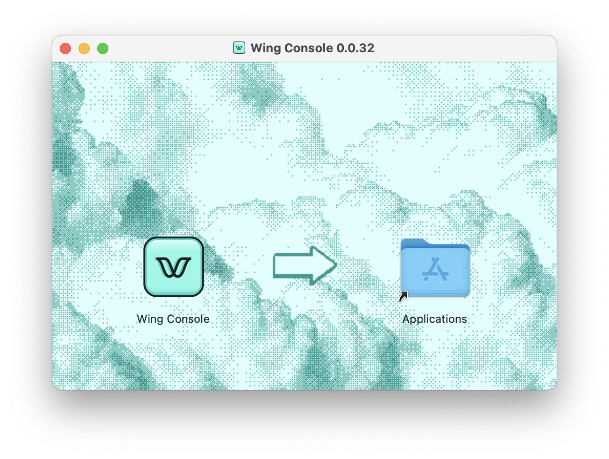

In this section you will install the Wing toolchain on your system.

The toolchain includes three tools:

1. **Wing CLI** - the compiler toolchain
2. **Wing VSCode Extension** - IDE support for Wing
3. **Wing Console** - a desktop app for interacting with your Wing programs.

## Prerequisites

To install Wing, you will need the following setup:

* [Node.js](https://nodejs.org/en/) version 18.x (we recommend [volta](https://volta.sh)).
* [VSCode] (recommended).

In order to deploy to AWS, you will also need:

* [Terraform](https://terraform.io/downloads).
* [AWS account] and the [AWS CLI] with [AWS credentials].

## Wing CLI

:::info

During the private alpha period, Wing is distributed through a private npm
repository. You will need to obtain a [personal access token] from GitHub with a
**packages:read** scope and then login your npm client like this:

```sh
npm login --scope=@winglang --registry=https://npm.pkg.github.com
Username: "lowercase-github-username"
Password: "the just created Github token"
Email: "your github email"
```

This token can also be used to keep the VSCode extension up to date with additional `repo` permissions.
:::

Install the Wing CLI through npm:

```sh
npm install -g @winglang/wing
```

Check that the installation was successful:

```sh
wing --version
```

## Wing IDE Extension

This extension adds support for the Wing language to [VSCode]. You don't *have*
to use it, but it's great.

1. [Download](https://github.com/winglang/wing/releases/latest/download/vscode-wing.vsix) the extension package from the GitHub releases page.
2. In your terminal, run:
    ```sh 
    code --install-extension ~/Downloads/vscode-wing.vsix
    ```
3. To enable automatic updates, add your GitHub [personal access token] to the
   extension's settings under **Wing** => **Updates** (highly recommended given
   Wing's fast pace of development).

## Wing Console

:::caution Wing Console is currently only supported in macOS

Click :thumbsup: on [this issue](https://github.com/winglang/wing/issues/630)
to indicate that you are looking for Windows support, or :thumbsup: on
[this issue](https://github.com/winglang/wing/issues/723) to indicate that you
are looking for Linux support.

:::


The Wing Console is a desktop application that allows you to interact with your
Wing applications running locally on the cloud simulator.

1. [Download](https://wing-console.s3.amazonaws.com/wing-console.dmg)  the latest version of the **Wing Console**.
2. Accept the license agreement and drag the Wing Console app into **Applications**:




[AWS account]: portal.aws.amazon.com/billing/signup
[AWS CLI]: https://docs.aws.amazon.com/cli/latest/userguide/install-cliv2.html
[AWS credentials]: https://docs.aws.amazon.com/cli/latest/userguide/cli-configure-files.html
[personal access token]: https://github.com/settings/tokens/new?description=Winglang%20Beta&scopes=repo,read:packages
[VSCode]: https://code.visualstudio.com/
