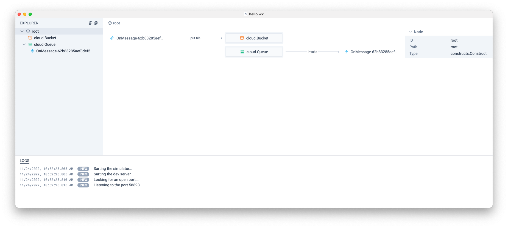
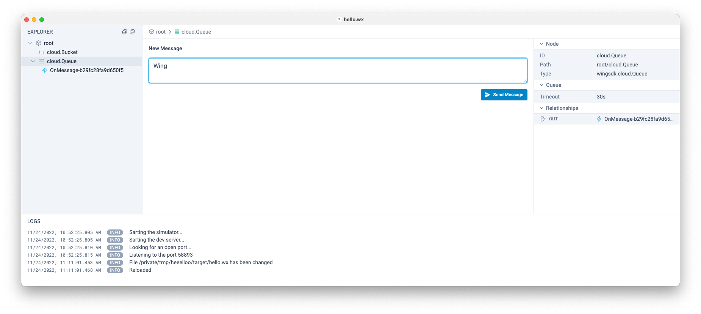
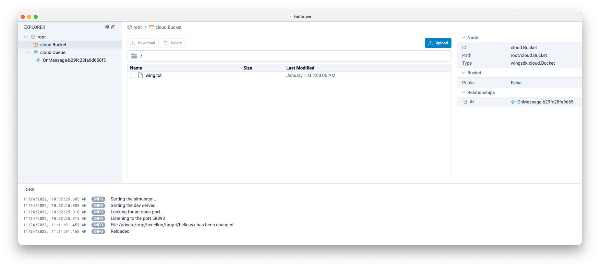
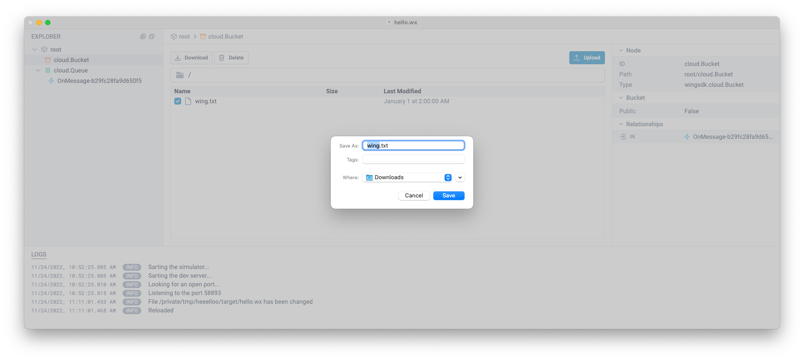

The Wing Console is a graphical user interface that can be used to interact with
Wing applications on the local machine.

:::info

Make sure you have [installed](./installation#wing-console) the Wing Console on your system
before getting started with this step.

If you are unable to install the Console (e.g. you are running on Windows) or wish to skip
this step, jump over to the [testing programmatically](./simulator) page.

:::

## Opening your app in the console

We can use the Wing CLI to start the console with our newly created app file:

```sh
wing run target/hello.wsim
```

This will start the Wing Console desktop application with the following view:



## The console view

In the main view you'll see two resources: a **Queue** and a **Function**.
You'll also notice that the function is connected to the queue through the
`message` event.

Once you click on the queue resource, the console will navigate into the queue
resource. The inspector pane on the right will show information about your
queue, as well as any relationships (in our case, an outbound relationship to
the function that handles messages).



## Sending a message to the queue

In the center you should be able to type in a message and send it to the queue.
Type `Wing` and hit **Send Message**.

## Viewing the file

On the left sidebar click on the Bucket, you will see the following view:



Now, check the `wing.txt` file and download it, using the download button



The downloaded file should contain `Hello, Wing` text 

## Congrats! :clap:

You have just written and tested your first Wing program!


---

Next we'll see how you can interact with the same simulated cloud application
directly through the Simulator API.
