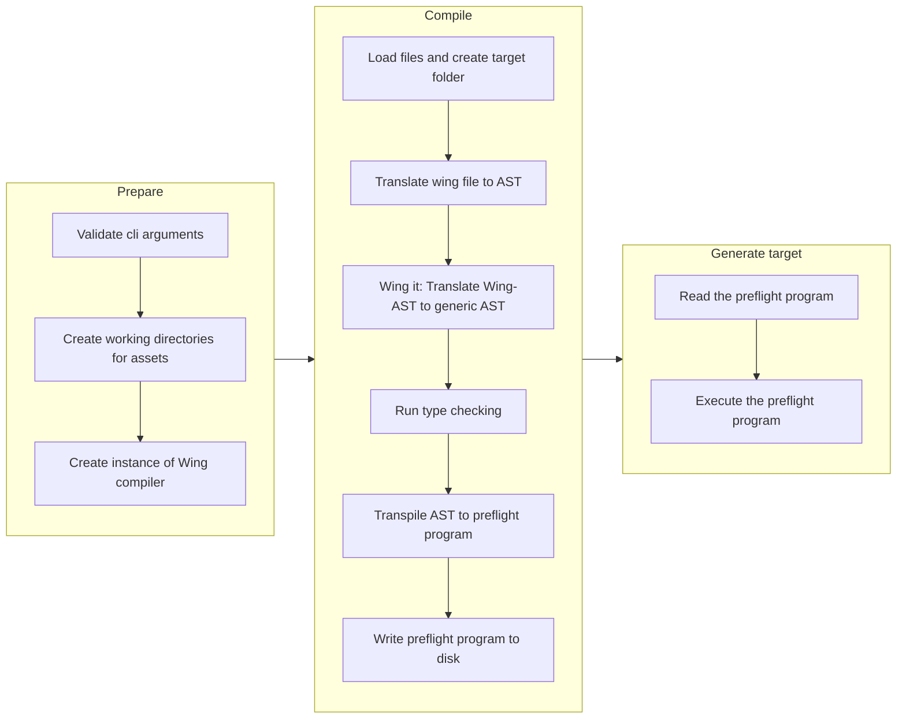
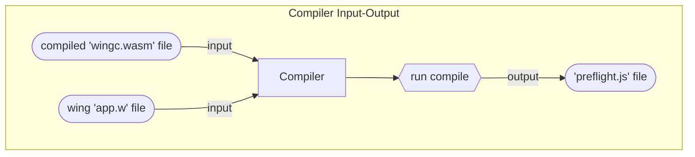
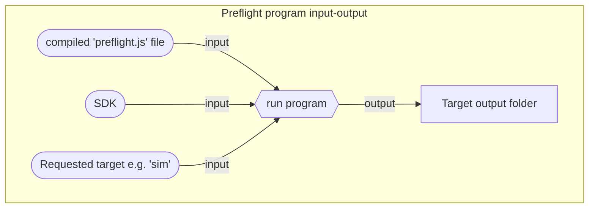

The Wing CLI is a command line interface for Wing. It is used to compile, test, and run Wing
programs, and we hope it will become your best friend.

## Installation

The CLI is distributed as an npm package which can be installed globally using:

```bash
npm i -g winglang
```

The usage is:

```bash
$ wing <command> <options>
```

## Run: `wing run` / `wing it`

You can use the `run` command (or `it`) when you want to interact with your Wing program in the
[Wing Console](/getting-started/console).

Usage:

```
$ wing run|it [<ENTRYPOINT.w> | <PROGRAM.wsim>]
```

The `run` command takes a single positional argument which can be one of:

- `ENTRYPOINT.w` is an entrypoint for a Wing program (source code). In this case, Wing Console will
  *watch for changes* and will automatically recompile your program when the source code change.
  The entrypoint is optional if there's a single `.w` file in the working directory (in which case you
  can just type `wing it` and it will run this file).
- `PROGRAM.wsim` is the output of `wing compile -t sim`

## Compile: `wing compile`

You can use the `compile` command to compile a Wing program into a deployable artifact.

```
$ wing compile --target <TARGET> <ENTRYPOINT.w>
```

The `ENTRYPOINT.w` specifies the entrypoint file to compile (e.g. `hello.w`).

The `--target` option is **required**, and specifies the target platform to compile for. The
following targets are supported:

* `sim` - [Wing Simulator](#sim-target)
* `tf-aws` - Terraform/AWS
* `tf-azure` - Terraform/Azure

### `sim` Target

The Wing program is going to be compiled for the Wing simulator (`.wsim`).

Usage:

```sh
$ wing compile --target sim ENTRYPOINT.w
```

The output will be under `target/ENTRYPOINT.wsim` and can be opened in one two ways:

* Interactively using [Wing Console](/getting-started/console) using `wing it target/hello.wsim`.
* Programmatically using the `Simulator` class ([instructions](/getting-started/simulator)).


### `tf-aws` Target

Compiles your program for Terraform and run on AWS.

Usage:

```sh
$ wing compile --target tf-aws ENTRYPOINT.w
```

The output includes both a Terraform configuration file (under `target/cdktf.out/stacks/root`) and
JavaScript bundles that include inflight code that executes on compute platform such as AWS Lambda.

You can deploy your stack to AWS using Terraform ([instructions](/getting-started/aws)).


### `tf-azure` Target

Compiles your program for Terraform and run on Azure.

For example:

```sh
$ export AZURE_LOCATION="East US"
$ wing compile --target tf-azure hello.w
```

The variable `AZURE_LOCATION` is required and indicates the [deployment
location](https://github.com/claranet/terraform-azurerm-regions/blob/master/REGIONS.md) of your
stack.

The output includes both a Terraform configuration file (under `target/cdktf.out/stacks/root`) and
JavaScript bundles that include inflight code that executes on compute platform such as Azure
Functions.

You can deploy your stack to Azure using Terraform ([example](/getting-started/aws)).

### `tf-gcp` Target

Compiles your program for Terraform and run on Google Cloud Platform.

For example:

```sh
$ export GOOGLE_PROJECT_ID="my-project"
$ export GOOGLE_STORAGE_LOCATION="US"
$ wing compile --target tf-gcp hello.w
```

The variable `GOOGLE_STORAGE_LOCATION` is required and indicates the [deployment
location](https://cloud.google.com/storage/docs/locations) of all storage
resources (such as buckets and queues). The variable `GOOGLE_PROJECT_ID` is required and indicates
the project ID of your stack.

The output includes both a Terraform configuration file (under `target/cdktf.out/stacks/root`) and
JavaScript bundles that include inflight code that executes on compute platform such as Google Cloud Functions.

You can deploy your stack to GCP using Terraform ([example](/getting-started/aws)).

### Plugins

Additionally the `compile` command can be provided an optional list of plugins to use during the compilation process.

```sh
$ wing compile --target tf-aws ENTRYPOINT.w --plugins PLUGIN1 PLUGIN2
```
Each plugin can be an absolute paths or relative path to a JavaScript file. For more 
on how to create a plugin, see [Compiler Plugins](/reference/compiler-plugins).

## Test: `wing test`

The `wing test` command can be used to compile and execute tests in Wing applications.

Usage:

```sh
$ wing test ENTRYPOINT...
```

This will compile each entrypoint, and for each entrypoint it will invoke all `cloud.Function`s with
that start with `test:` (or simply called `test`).

For example ([test_bucket.w](https://github.com/winglang/wing/tree/main/examples/tests/valid/test_bucket.w)):

```js
bring cloud;

let b = new cloud.Bucket();

new cloud.Function(inflight (_: str) => {
  assert(b.list().length == 0);
  b.put("hello.txt", "world");
  assert(b.list().length == 1);
}) as "test:put";

new cloud.Function(inflight (_: str) => {
  b.put("hello.txt", "world");
  assert(b.get("hello.txt") == "world");
}) as "test:get";
```

Now, if we run the following command:

```sh
$ wing test test_bucket.w
pass | test_bucket.w | root/test:get
pass | test_bucket.w | root/test:put
```

We will see that both functions were invoked and that the tests passed.

## CLI Architecture

### CLI - compile explained

The Wing CLI command `compile` is responsible for translating the Wing application from a `*.w` to a target that then can be run and either deploy resources to the cloud or run in the simulator or console.

The `compile` command has three phases.



**Prepare**

The first one is the `prepare` phase. Here the input arguments of the user are validated and folders for the generated target assets are created. Once this is done an instance of the Wing compiler ist created.
The Wing compiler is a Rust application that is compiled to a WebAssembly file (`wingc.wasm`). The WebAssembly expose methods that can be invoked from the Wing Cli nodeJS program.
After the Compiler instance is initialised the Wing application file is parsed to the compiler `compile` method.

**Compile**

The Wing compile itself is a Rust application that reads the Wing application file and generates a nodeJs application that is called `pfreflight.js` which contains a program that generates the asset for the target.



The compile process begins with making sure the target folder exist and create if not.
After the validation phase the Wing application file is loaded and translated into a AST.
For this translation the `tree-sitter` library is used which uses a Wing implementation that contains the Wing language.
Once the AST is created the `wingit`command is invoked which does the following:
It traverses the AST nodes and filter out unnecessary nodes like comment lines in the Wing application file. The remaining nodes are then converted into generic `statements`.
The result is a `Scope` object that is the input for Type checking.
If no errors are found in the type checking phase the actual `preflight` program is generated.

To generate the preflight code the `.jsify` function is called that contains a mapping for all the statements into `javascript`.
The final step is writing the preflight code to the disk.

**Generate target**

Final step in the `compile` command of the Wing CLI is the generation of the actual target code generation.
Therefore the `preflight.js` file is executed with a provided target.
The preflight code then uses the Wing SDK to resolve the target specific implementation.



The final result are assets in the `target` folder. These assets can be for example the terraform code.
