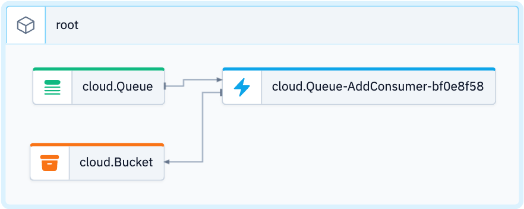

# Hello World

In the example the code is creating a bucket and a queue object using a cloud service or library, and setting up a consumer function for the queue that stores a file in the bucket with a modified message.


## Code
```ts (wing)
bring cloud;

let bucket = new cloud.Bucket();
let queue = new cloud.Queue();

queue.setConsumer(inflight (message: str) => {
  bucket.put("wing.txt", "Hello, ${message}");
});
```
[Edit in Playground](https://play.winglang.io/?code=YnJpbmcgY2xvdWQ7DQoNCmxldCBidWNrZXQgPSBuZXcgY2xvdWQuQnVja2V0KCk7DQpsZXQgcXVldWUgPSBuZXcgY2xvdWQuUXVldWUoKTsNCg0KcXVldWUuc2V0Q29uc3VtZXIoaW5mbGlnaHQgKG1lc3NhZ2U6IHN0cikgPT4gew0KICBidWNrZXQucHV0KCJ3aW5nLnR4dCIsICJIZWxsbywgJHttZXNzYWdlfSIpOw0KfSk7)

## Code Including Test
```ts (wing)
bring cloud;
bring util;

let bucket = new cloud.Bucket();
let queue = new cloud.Queue();

queue.setConsumer(inflight (message: str) => {
  bucket.put("wing.txt", "Hello, ${message}");
});

let tick = 0.01s;

class TestHelper {
  static inflight waitFor(predicate: inflight ():bool, ) {
    let var i = 0;
    while i < 600 {
      i = i + 1;
      if predicate() {
        assert(true);
        return;
      }
      util.sleep(tick);
    }
    assert(predicate());
  }
}

test "Hello, world" {
  queue.push("world");
  TestHelper.waitFor(inflight ():bool => {
    return bucket.tryGet("wing.txt") == "Hello, world";
  });
}
```


