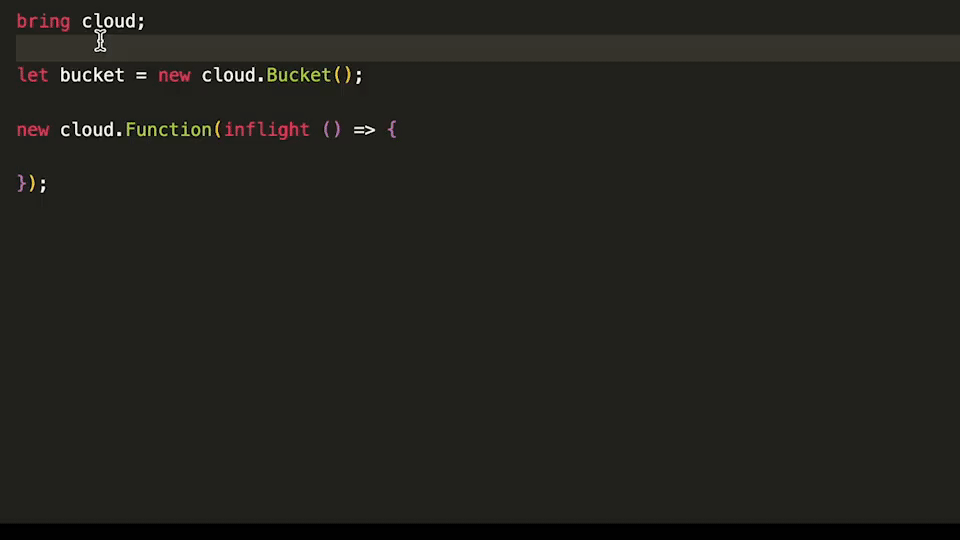

We believe that the cloud is a new kind of computer that requires a [new programming paradigm](https://docs.winglang.io/#what-is-a-cloud-oriented-language) to fully utilize it.

While it is possible to use this new paradigm with existing languages, we believe that a language that natively supports it will make using it much easier by streamlining common patterns, in a way that is impossible to accomplish with existing ones. Kind of like what C++ did for object orientation.

[Inflight](https://docs.winglang.io/concepts/inflights) functions and resources are a great example. We believe it is impossible to ensure this level of isolation and interaction semantics in existing languages through a library, or even through a compiler extension. We've seen some worthy efforts in projects like [Pulumi's Function Serialization](https://www.pulumi.com/docs/intro/concepts/function-serialization/) and [Functionless](https://functionless.org/), and in all of these cases, there are either compromises in safety (e.g. it is possible to capture mutable objects) or in the programming model (e.g. type system is too complex).

With Wing, we believe we can provide a very elegant solution for both.

As seen below, Wing has phase modifiers that are understood by the language server, which allows it to suggest different completion options for the same object, based on the execution phase from which is it accessed.

Creating a new language that is tailored to the cloud from the ground up also allows us to assemble a variety of features (some of which exist in other languages, of course) that, when put together, offer a delightful cloud development experience.
You can read more about what these features are [here](https://docs.winglang.io/faq/good-fit).

