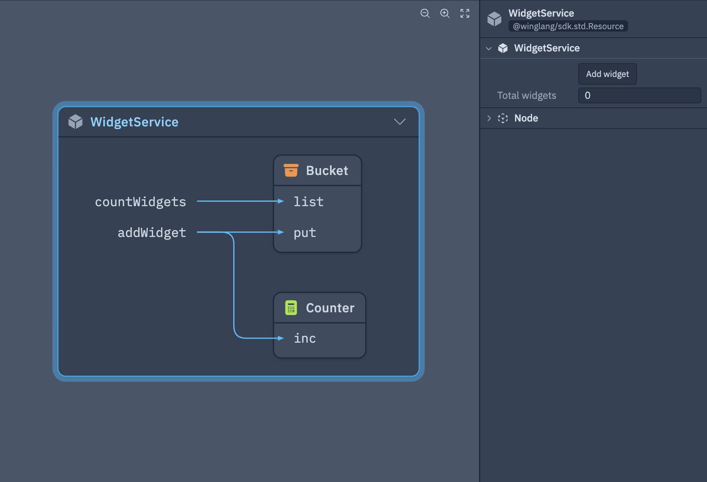

The `ui` module lets you create tools for interacting with resources in the Wing Console.

Using components like `ui.Button`, `ui.Field`, or `ui.Table`, it's possible to trigger actions in Wing apps or display important information to the user.

Here's an example of a class which has a button and field showing the internal state of the resource:

```js playground example
bring cloud;
bring ui;

class WidgetService {
  data: cloud.Bucket;
  counter: cloud.Counter;
  new() {
    this.data = new cloud.Bucket();
    this.counter = new cloud.Counter();

    // a button lets you invoke any inflight function
    new ui.Button("Add widget", inflight () => { this.addWidget(); });

    // a field displays a labeled value
    new ui.Field(
      "Total widgets",
      inflight () => { return this.countWidgets(); },
      refreshRate: 5s,
    );
  }

  inflight addWidget() {
    let id = this.counter.inc();
    this.data.put("widget-{id}", "my data");
  }

  inflight countWidgets(): str {
    return "{this.data.list().length}";
  }
}

new WidgetService();
```

Here is what the UI looks like in the Wing Console:



---

```mdx-code-block
import DocCardList from '@theme/DocCardList';

<DocCardList />
```
