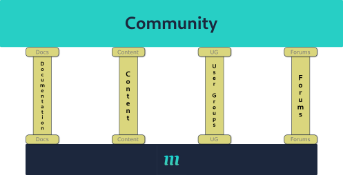

# #0033 - The Wingers Community

* **Author(s)**: @mbonig
* **Submission Date**: 2022-07-11
* **Stage Date**: 2022-07-11

Processes and techniques to encourage healthy community involvement.

## Working Backwards

It's 14th June 2023. We've just wrapped up our first virtual WingCON on our Gather space. We had speakers from all around our community discussing everything from how to get started with Wing, how to contribute to Wing, and the things they've been building using Wing. Our keynote speaker was Matt Coulter, one of our first members of the Pilot program, community members who have led the way in guiding people to the Wing cloud. The conference was held in our Gather space, where the community commonly meets online for day-to-day collaboration.

We had over 500 people engage directly during the conference and over 5000 people sign up for the event to watch the YouTube and Twitch streams. Tickets were promoted through our various social accounts on Twitter, LinkedIn, Facebook, Instagram, YouTube and TikTok. We even had two Pilots who live-tweeted the Conference announcements. Announcements were covered on TechCrunch. A blog post written about Wing was briefly at the top of Hacker News.

Conference members were active in breakout rooms discussing new applications they were building with Wing and how they were reaching record setting Time to Markets, impressing their management with the speed and reliability of deployments.

Pilots and Stewards (our non-technical community moderators) guided new people around Gather showing off the integrations with the Feature Board (where people can brainstorm new features in WingSDK and WingLang and vote on what should be developed), the Leaderboard (where top community contributes are highlighted, ranked by PRs, Blogs, and StackOverflow questions answered), and areas where developers can collaborate in live group calls.

The feature request board in Gather had 200 new entries posted in just the first hour of the conference and over 2000 up votes applied to both new and existing issues, completely re-organizing the next 3 months worth of deliverable features in both WingSDK and WingLang.

The conference was such a resounding success that we closed with the announcement that in 6 months we'd be hosting our first in-person WingCON!

In the days preceding the conference our YouTube channel hit 10k subscribers thanks in part to both regular videos highlighting community content, and the bi-weekly Office Hours series where Wing users are invited to come and have questions answered live by Pilots building community-requested applications. Short videos which highlight small tips and tricks are posted each day to YouTube Shorts and TikTok with textual versions posted to the other social accounts.

Over on StackOverflow we were recognized by Jeff Atwood in a blog post for having the highest ratio of answered questions of any new language in SO's history. Analytics shows that new WingLang and WingSDK tagged questions get responses and verified answers on average of 4 hours or less. This was achieved by tightly integrating the StackOverflow questions with both the Wingers Discord channel, notifying community members within seconds of a new question and adding onto SO's gamification with a Bounty Board and reward points to anyone who answers the questions. We actually had to implement a resolution process ran by moderators because Wingers were beginning to argue over who answered the question first. Hackathons were also run on a monthly basis, all in Gather to encourage new developers to contribute.

Speaking of Discord, we just crossed the total active user count of the cdk.dev Slack server. Our Stewards are moderating content for both code of conduct violations (for which we have gone all 9 months without a single incident) and for good answers (helped by Pilots). We have automatic integration notifications coming in from GitHub Issues against both the WingLang and WingSDK repos. Pull Requests get a bounty point system, rewarded to those who review and actively engage in the PR. Points are rewarded by Pilots and Stewards through a retroactive review process when PRs are closed. Any Issue or PR that is created gets a notification in Discord and if PRs and Issues don't get any labels or comments within 2 hours they are notified again in Discord of an SLA violation. The entire process is built directly into Discord.

Open Issues and Feature requests are also sized by points and rewarded to implementors when PRs are closed. Feature requests are up-voted on the Feature Board in Discord and Gather using points earned by Wingers. Issues are similarly up-voted by spending points earned in answered questions and submitting PRs. Any user registered in Discord can collect points and redeem them for up-votes on the Feature board or for swag from the Winger store, which includes shirts, socks, pins, backpacks and many other Wing-branded stuff. Wingers are highlighted on the aforementioned Leaderboard on Gather as well as Discord.

## Public FAQ

### How are WingPoints earned?

WingPoints are rewarded by Pilots and Stewards to community members who have either answered questions on StackOverflow or in the Discord channels. Additionally, Wingers can earn WingPoints by submitting PRs, reviewing PRs, and closing Issues. Pilots and Stewards use an interactive review process built into Discord to review activity and reward points accordingly. Pilots and Stewards are provided a set of standards and guides for how to hand out points, but are ultimately given discretion.

## Engaging the Community

So, how do we get there? It will be a 4-pillar approach. Each pillar will support the community and each will be needed to provide the full support needed. 

Each of the 4 pillars support different, but not exclusive, aspects to the community involvement.

### Documentation

Documentation is the main point of entry for most developers [see CDK Community Survey - Help section](https://matthewbonig.com/2022/07/20/community-survey-2022/). 
Documentation is important not only during the initial learning curve but also during ongoing development. Documentation is what most developers of Wing will come back to on a daily basis when building applicaitons.

To ensure that documentation of all Monada features are providing the maximum value to the community:

* All features will get documented with very rare exceptions. Insufficient or unclear documentation will prevent a feature from being released. Documentation for every feature, every property, will be considered a first-class consideration. Good, clear documentation will be checked during the PR process.
* Documentation will be written as close to the code as possible and surfaced through public sites that are generated from in-code documentation
  * The development of the feature is expected to carry with it the documentation for that feature.
  * Documentation can be modified by anyone who sees a need to clarify feature usage or capabilities. Multiple contributors to a feature's documentation is encouraged as it's easy to miss vital details of a feature when developing it and having someone unfamiliar with the feature contribute to the documentation helps ensure that all relevant information is documented and not lost to 'tribal knowledge'. We will push during the PR process to make sure that reviewers understand the documentation provided and expand if needed to make anything more clear.
  * We must take care when surfacing these docs, it's easy to generate HTML from the source code documentation but not always easy to make that documentation easy or useful to navigate. See the section at the end about examples of good and bad documentation.
* Editing docs, both generated and manually created, needs to be as simple as possible to encourage easy and frequent updates. This probably means providing links directly on the page that will take the user to a GitPod that makes it easy.
* Examples, both minimal and common variations, of a feature's usage should be included in documentation.
  * E.g.: If documenting a new construct that represents block storage then an example of the minimum usage should be documented. Additionally, examples that show enabling event notifications (e.g. new object created), enabling public access, and enabling storage logging should all be included in the documentation.
  * **Note**: The AWS CDK does a good job at providing these examples in the Module-level README. For example, the [EC2 module](https://docs.aws.amazon.com/cdk/api/v2/docs/aws-cdk-lib.aws_ec2-readme.html).

In addition to using Wing and its features, there will be documentation around the contribution process that should include:
* Getting Started - How to go from 0 to PR in under 5 minutes (for something as simple as a typo fix).
* SLAs for contributing work. This would be an initial list that would likely change over time:

| Event                       | Description                                                                                       | SLA                                             |
|-----------------------------|---------------------------------------------------------------------------------------------------|-------------------------------------------------|
| PR/time to first comment    | Time from PR submission to first response from a maintainer                                       | 2 hours depending on maintainer availability. * |
| PR/time to first review     | Time from PR submission to first review from a maintainer, either approving or requesting changes | 8 hours *                                       |
| Issue/time to first comment | Time from the Issue creation to first response from a maintainer.                                 | 4 hours *                                       |
| Issue/time to close         | Time from the Issue creation until it's closed.                                                   | 5 days *                                        |                                                              
&ast; Early on the maintainers will likely be just Monada employees so these hours will fall into reasonable Israeli work hours, 09:00->17:00 (UTC+3). Later on as community members are identified and promoted to maintainers, these hours will open up.

* Pull Request Templates in GitHub that clearly detail what information is needed by maintainers to review a PR, including Issues that are specifically addressed.
* Expectations from community members to be promoted to a maintainer role for a given project.
  * Some ideas to get us started:
  * Having submitted X number of PRs themselves.
  * Having reviewed Y number of PRs.
  * Having been a frequent contributor.
  * Has earned Z amount of points through PRs/Issues/Questions answered.

The goal of the documentation pillar is to be the first and most common stop for anyone working day-to-day in Wing and to ensure users get the data needed to be developing without having to hop between 13 web pages and break their development flow. Since most IDEs now include source-code documentation directly in the editor, it's even more important to make sure that what is surfaced is as complete a picture as possible.

### Content

Content refers to written and video content which aims to expand on the documentation already provided. While documentation will provide good reference for specific features, showing the interaction between features will be Content's concern. This includes, but is not limited to, examples and libraries. 

For example, a blog and video will be produced that details what Wing is. While this will obviously also be on the main landing pages, those pages will likely keep more to 'elevator speech' approaches that familiarize the reader with the overall project while content will take deeper dives into the advantages of the system, how to get started with it, how to use it, and where to go next.

Also, content will include discussions with members of the community and Monada team members to help engage the community and put "faces to names", encouraging a more personal relationship with those designing the features.

Examples of good content:
* [Scott Hanselman](https://www.youtube.com/shanselman) - a long time developer and advocate for various Microsoft technologies he's nearly synonymous with ASP.Net and related software. He was one of the first in what became the Developer Relations role.
* [Kelsey Hightower](https://en.wikipedia.org/wiki/Kelsey_Hightower) - a developer advocate for Kubernetes whose unique presentation style which weaves story telling with complex technical concepts creates engaging presentations (my favorite is probably [Path to Serverless](https://www.youtube.com/watch?v=oNa3xK2GFKY) in which he showed how to run Fortran in Lambda).
* [Fireship](https://www.youtube.com/c/Fireship) - a YouTube channel with great content that is engaging and informative.

Characteristics of bad content:
* Content that doesn't present a problem to be solved, but only a solution to an undefined problem.
  * Software systems are tools meant to solve specific problems. Without defining the problem you never create the reason for the solution. 
  * Clearly defined problems that matter to the audience engages the user with "yup, that's my issue too" almost forcing them to listen.
  * Problems either too obscure for the audience or not relevant will never resonate.
* Poor production quality. For example:
  * poor grammar and spelling in written content
  * poorly edited written content
  * low gain audio in video content
  * unclear audio or excessive background noise
  * screencasts with fonts too small or hard to read.
  * video of the presenter that is low quality or has a distracting background
* Unnecessary or un-engaging content that could have been edited out. For example:
  * An excessive use of 'filler' words like 'um' or 'like'. 
  * 30 seconds of watching the presenter try to find a specific line of code they lost track of.
  * Getting off-topic and talking about issues not directly related to the problem topic.

Characteristics of good written content:
* Good grammar, spelling, and proper usage of names (e.g. don't abbreviate GitHub to GH, don't spell it Github). 
* Proofread and editing by a non-technical resource who can proxy for the least-informed user in the community *.
* A well-defined and concise story to tell, presented at the beginning and followed through to the end with a good summary of what was covered.
* New terms are clearly defined with good external references.
* Clean and uncluttered diagrams and images to help tell the story.

&ast; This could be difficult to define and find directly on the Monada team as we're all very closely related to the product and being 'disconnected' enough to be able to proxy a "new to Wing" user could be difficult. Outside resources (under NDAs) could be leveraged. 

Characteristics of good video content:
* High resolution output video, 1920x1080 or above.
* Clear audio, both recorded cleanly with a high quality mic (no laptop mics) and cleaned up in post-processing (using compression and gates).
* High quality video of the presenter, recorded at 1920x1080 or above. Well lit with a clean background that is not distracting, or ideally chroma-key'd so the background can be replaced as needed.
* A well-defined and concise story to tell, presented at the beginning and followed through to the end with a good summary of what was covered.
* Exposes publicly all code examples used.

Community content should be highlighted and shared through a Resources section of the Wing website, similar to the cdk.dev website.

We will also maintain an 'Awesome' page, which will be hosted on Github and highlight various 3rd party resources and maintained by the community. E.g. github.com/sindresorhus/awesome

The goal of the content pillar is to also provide users with multiple avenues for learning to meet their preferred learning styles, whether written, visual, or auditory.

### Forums

Forums will take on two forms with Wing. First, is an active or "live" forum, Discord. This Discord server will be open to the community and encourage open discussions in real-time. The second is [StackOverflow questions with a specific "winglang" tag](https://stackoverflow.com/questions/tagged/winglang). Once we get some momentum going with "winglang" and "wingsdk" tags we'll look into creating a [Collective](https://stackoverflow.com/collectives).

Discord is our live discussion community of choice. Slack was also considered except Slack is a product focused on business and does not provide tools important to moderation without a paid license, like user and content moderation, which is unaffordable at any expected scale. Discord provides a robust API and both slash commands and full bots, similar to Slack, while also providing better management of users through moderation tools and the ability to easily assign roles to users.

A Code of Conduct, like a derivative of the [CNCF CoC](https://github.com/cncf/foundation/blob/main/code-of-conduct.md), will be published and enforced on the live forum to ensure and open and inviting community.

[Gather](https://www.gather.town/) will also be used to foster an online community providing face to face communications for discussions about problems and development.

StackOverflow is our choice for asynchronous communication. StackOverflow has proven to be an effective Q&A forum for a wide range of topics. Initially we'll use the public site and monitor for questions tagged "winglang" or "wingsdk". However, value may be found in using a specific StackExchange site through the [Area51 program](https://area51.stackexchange.com/). Gitter, Github Discussions, and Reddit will not actively be used.

#### Discord Moderation

Moderation of the Discord servers will fall into a few needs:
* Moderate for Code of Conduct violations.
* Moderate for irrelevant content (anything not related to Wing unless done in specific channels like #off-topic).
* Moderate for unanswered or incorrectly answered responses.

#### StackOverflow Moderation

Moderation of StackOverflow will fall into just one need (for now):
* Moderate for unanswered or incorrectly answered responses. 

#### Discord Integrations

By building a number of integrations we can make Discord our "one-stop shop" for all things pertinent and timely to Wing.

* Send GitHub PR events into a contributor channel to ensure a timely review of Pull Requests.
  * New PR created
  * PR SLA violation
  * PR Closed
* Send GitHub Issue events into a contributor channel to also ensure timely review.
  * New Issues
  * Issue SLA violation
  * Issue Closed
* Send release notifications to a specific 'releases' channel.
* New "winglang" or "wingsdk" tagged StackOverflow questions.
* A bot command which will print the leaderboard on request
* A bot that will print the featureboard on request

Wingers who contribute in Discord can be awarded points by moderators for answering questions and helping fellow Wingers.

The goal of forums is to provide an avenue for community members to ask questions regarding Wing's features and get help from the community in solving their problems.

### User Groups

User groups are community meetup events where users of Wing can come together and discuss content, features, and ask questions about issues in a more social environment.

Early on, content will need to be presented at user groups that already exist, targeting cloud-provider specific user groups like AWS User Groups and Azure User Groups.

Later on, Wing-specific user groups will be created in popular social areas.

The goal of the user groups pillar is to provide additional learning opportunities and engage new community members and strengthen existing relationships within the community.

## Examples of good/bad documentation

* Example of bad generated docs:
  * SDK Nodejs V3 SDK. It starts good, with a main landing page that covers a lot of the initial concerns around getting started, some examples (although using an IIFE syntax for async functions can be confusing to inexperienced JS developers), however once you start diving into specific commands then it can be a mess of navigating multiple pages and links just to understand the inputs and outputs of specific commands. Take the [@aws-sdk/client-dynamodb.QueryCommand](https://docs.aws.amazon.com/AWSJavaScriptSDK/v3/latest/clients/client-dynamodb/classes/querycommand.html), while the initial command guides a user through the purpose of the command the first example provided is useless (showing no real 'input' or 'config' values). The `Heirarchy` and `Implements` commands are only really useful to a seasoned Typescript developer and provides no value to the usage of the command. Furthermore, if the user does click through to the definition of the QueryCommandInput interface then they are met with a `Hierarchy` section which (again) provides little value.  Properties are then defined, and we see a mix here of valuable information (Optional, Name, Type) and useless (Inherited, Overrides, Defined In). Finally, while many parameter definitions are good, there is a little too much deferred to the AWS API documentation.
  * Another example from the Node V3 SDK, since I'm picking on it... in the S3 module's [CopyObject command's StorageClass](https://docs.aws.amazon.com/AWSJavaScriptSDK/v3/latest/clients/client-s3/interfaces/copyobjectcommandinput.html#storageclass) doesn't specify valid values. Worse, the link provided also doesn't provide a list of valid String values that the user can provide. This is maybe the worst case I can find as the user has to find the documentation for the [underlying HTTP API](https://docs.aws.amazon.com/AmazonS3/latest/API/API_CopyObject.html#API_CopyObject_RequestSyntax) and know that the header `x-amz-storage-class` provides the details needed (and from what I've found, this is the only place in *all* of the S3 documentation to find these valid String values). This problem is endemic across all the API SDKs, as I saw similar, or worse, cases in the Python SDK (Boto3), the Java SDK, and the .NET SDK.
  * Example of a good generated doc:
    * The AWS CDK has pretty good generated docs, specifically let's look at the [S3 Bucket construct](https://docs.aws.amazon.com/cdk/api/v2/docs/aws-cdk-lib.aws_s3.Bucket.html):
      * Language-specific class names are clearly defined at the top, making it very clear what the user needs to import/include into their code to use the construct
        * This could be made better if the actual code to do the import was made available. While a lot of users probably understand the basics of importing external modules it's still not a given and including this would reduce the frustration in new users.
      * An example is included in the very beginning.
        * This is an odd example since the creation of the bucket is through an import (.fromBucketName) and is not the primary construct in the example (the codebuild.Project is the primary construct in this example).
      * An initializer syntax is provided, although similar to the AWS SDK Node V3 example mentioned above, this syntax isn't very useful as it neither provides concrete examples of valid values nor does this syntax vary wildly from construct to construct. All constructs in the CDK have similar signatures and only when creating non-constructs (like a [BlockPublicAccess object](https://docs.aws.amazon.com/cdk/api/v2/docs/aws-cdk-lib.aws_s3.BlockPublicAccess.html)) does this syntax start to vary and become important.
        * This could be made better by continuing to include concrete examples and not just a syntax definition. However, since this concrete example is usually just above this initializer syntax, this could be redundant and either removed, or moved lower down the page under more relevant information.
      * Construct Props then goes into the details of which most users are probably looking for.
        * There is redundancy between having the table and the list of properties with details right below it. The table could probably be removed in favor of the right-hand navigation.
        * Look specifically at the flag for autoDeleteObjects, which does a very good job at clearly providing a warning to users about this value and how a change in it can lead to data loss.
      * Methods are then used to detail extra-constructor changes.
        * Again, a table and then immediately a list of the same data is redundant.
        * Parameter types could be expanded instead of just referenced, making fewer hops for developers to find what they're looking for.
        * Some documentation is anemic: [toString()](https://docs.aws.amazon.com/cdk/api/v2/docs/aws-cdk-lib.aws_s3.Bucket.html#towbrstring).

## WingPoints

Wingers will be able to earn and spend points by contributing in the community. 

Wingers can earn points by:

* Submitting PRs
* Closing Issues 
* Answering questions in Discord
* Answering questions on StackOverflow

Wingers can spend points on:
* Upvoting Feature Requests
* Swag at the wing store
* ??

Additionally, a leaderboard and feature board will be present in Discord and Gather.

## Supporting Sites

### Feature Board

A feature board will need to be built that provides a list of features requested by the community. 
A site will be publicly available, linked on the main Wing website as well as in Gather and Discord.
Users will be able to add new features and either upvote or downvote features. Voting will require the user to 
spend WingPoints they have earned.

### Leader Board

A leader board will be built that provides a list of users registered in the system, sorted by their WingPoints.

### WingPoint Portal

A site for moderators to review and award WingPoints to users in the community.
