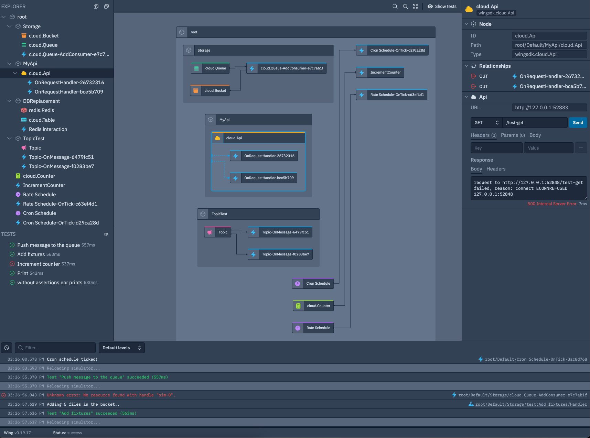

## What is a cloud-oriented language?

Wing is what we call a **cloud-oriented programming language**. It allows
developers to build distributed systems that fully leverage the power of the
cloud without having to worry about the underlying infrastructure.
It's best explained through an example:


```js
bring cloud;

let queue = new cloud.Queue(timeout: 2m);
let bucket = new cloud.Bucket();
let counter = new cloud.Counter(initial: 100);

queue.setConsumer(inflight (body: str) => {
  let next = counter.inc();
  let key = "myfile-{next}.txt";
  bucket.put(key, body);
});
```

In this simple application, every message that goes into the queue is written to
a new object inside a cloud bucket. An atomic counter is used to generate an
incrementing and unique key for each object.

***But don't let the simplicity of this example fool you!***

When compiling this code, the Wing compiler will produce a bundle of artifacts
that are ready to be deployed to a cloud provider. This bundle includes
[Terraform] files which define the infrastructure resources required for this
application and [JavaScript] code to run on cloud compute resources.

When deployed to the cloud, this application can handle an infinite amount of
traffic, with no need for you to explicitly take care of scaling, load
balancing, security policies, or any other infrastructure-related concerns. For
example, when targeting AWS, Wing will use Amazon S3 for the bucket, Amazon SQS
for the queue, Amazon DynamoDB for the atomic counter, and AWS Lambda for the
handler. It will also render least privilege IAM security policies, wire up
environment variables and produce the code bundles needed for this to work on AWS Lambda.

In addition to targeting cloud providers, Wing applications can also be compiled
to run inside a local **Cloud Simulator**. This means that you can now iterate
on your code without having to deploy it to the cloud, write **unit tests** that
cover your complete cloud architecture and **debug** your code in a local
environment.

Every Wing installation includes access to the Wing Console, a visual application-centric operations and management console that lets you interact with the cloud simulator.
Through the console you can view logs, inspect resources, and even run unit tests:



This is what we call **cloud-oriented programming**. It's a programming paradigm
which treats the cloud as a computer, and heavily relies on managed services and
distributed programming to build and deliver systems that are intrinsically
scalable, highly-available, and robust.

## Why you should consider Wing?

The cloud has evolved to become a ubiquitous platform for running many types of applications.
However, the cloud has also introduced a new set of challenges for developers.
Writing applications often requires understanding low-level details of cloud services, and barriers between the spaces of infrastructure and runtime code make it increasingly difficult to test and debug applications locally.

Wing addresses these challenges through several key pillars:

* **Iteration speed** - Wing applications can run in a local cloud simulator.
  This allows developers to iterate at a much faster pace, and to see the
  effects of incremental changes at milliseconds latency.
  Unit testing in Wing can validate architectures end-to-end without requiring deployments or heavy mocking.
* **High-level cloud primitives** - The batteries-included Wing Cloud Library allows developers to leverage the power of the cloud
  to its full extent through a set of rich, high-level and cloud-portable
  resources. This allows developers to build complete cloud applications without
  having to be infrastructure experts.
* **Distributed computing support** - Traditional languages are designed to tell a single machine what to do, but the cloud at its core is a big distributed system.
  Wing allows cloud applications to be written more naturally through the concepts of [preflight and inflight code](https://www.winglang.io/docs/concepts/inflights), which allow infrastructure and runtime code to be interleaved while
  giving developers the speed safety they expect from modern tooling.
* **Infrastructure as policy** - Infrastructure concerns such as deployment,
  networking, security, and observability can be applied horizontally through
  policies instead of inside the application code.

## This is a pre-release 🧪

We are working hard to make this a great tool, but there's still a pretty good 
chance you'll encounter missing pieces, rough edges, performance issues and even,
god forbid, bugs 🐞. 

Please don't hesitate to ping us on [Discord](https://t.winglang.io/discord) or 
[file an issue](https://github.com/winglang/wing). We promise to do our best to
respond quickly and help out.

Our <a href="https://www.winglang.io/contributing/status">Project Status</a> page includes
more information about stability and roadmap 👷‍♀️ 

[Terraform]: https://www.terraform.io/
[JavaScript]: https://developer.mozilla.org/en-US/docs/Web/JavaScript
