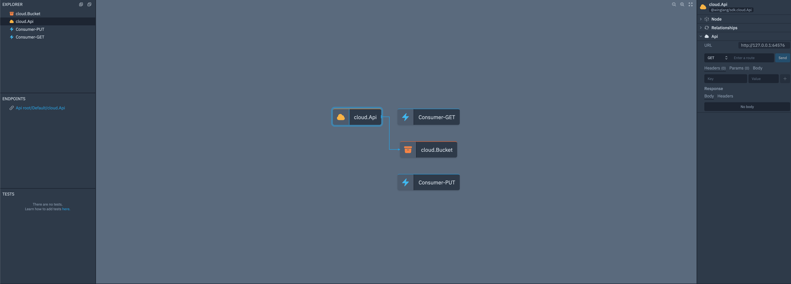
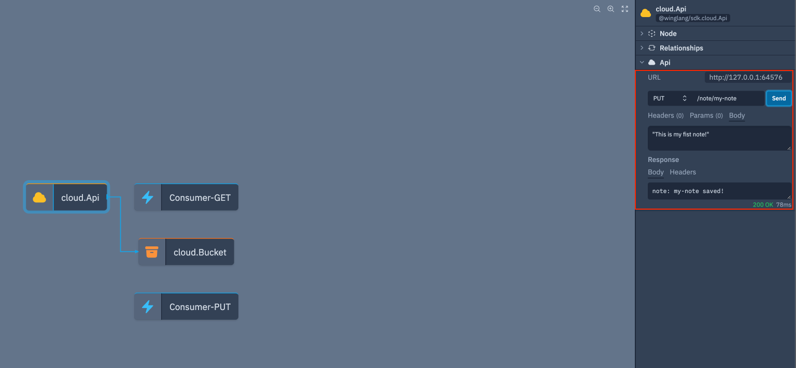
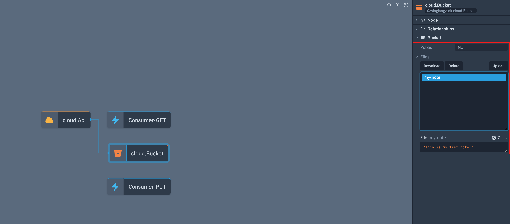
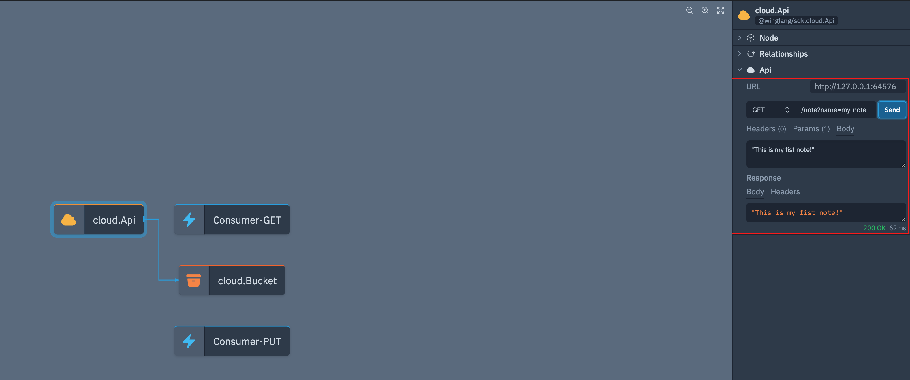
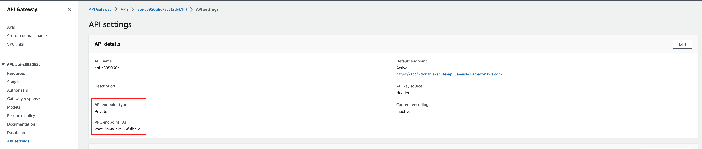

This tutorial is a guide for creating a [secure](https://docs.aws.amazon.com/apigateway/latest/developerguide/apigateway-private-apis.html) [API Gateway](https://aws.amazon.com/api-gateway/) inside an AWS Virtual Private Cloud (VPC) using Winglang. A private API Gateway in AWS is used when you need to expose APIs that are only accessible within your Virtual Private Cloud (VPC) or through specific endpoints that you define. This setup is essential for internal or private applications where security and controlled access are crucial.

Wing currently supports two programming languages: TypeScript and [Winglang](https://winglang.io). For the purposes of this tutorial, we'll use Winglang.

> Its recommended to use VSCode to follow along with this tutorial, as it has a Winglang extension that provides syntax highlighting and code completion. You can install the Winglang extension from the [VSCode Marketplace](https://marketplace.visualstudio.com/items?itemName=Monada.vscode-wing).


Let's start by installing the Wing CLI (you'll need Node.js >= 20.x installed):

```bash
npm i -g winglang
```

You can check the CLI version like this (the minimum version required by this tutorial is 0.58.10):

```bash
wing --version
0.58.10
```

> Before we get going it would be great if you joined the awesome people hanging out on the [Wing slack](https://t.winglang.io/slack).


Ok, now that we have the Wing CLI installed, let's create a new project using the `private-api` quickstart:

```bash
$ mkdir my-api
$ cd my-api
$ wing new private-api
```

Let's check out what we now have in our project directory:

```bash
my-api/
├── main.w
├── wing.toml
├── package-lock.json
└── package.json
```

If we look at the `main.w` file, we'll see a code template for a simple note-taking app:

```jsx
bring cloud;
bring http;

/**
 * The example below is a simple note-taking app.
 * It uses a cloud.Bucket to store notes and a cloud.Api to expose a RESTful interface.
 * 
 * The api has two endpoints:
 * - GET /note?name=NAME to get a note by name
 * - PUT /note/:NAME to save a note by name
 * 
 * The app also includes two cloud.Functions to consume the api.
 * - Consumer-PUT reads a string like: `NAME:NOTE` and calls the api to save it.
 * - Consumer-GET reads a string like: `NAME` and calls the api to get the note.
 * 
 * These consumer functions are not required for the app to work, but since our api is private, they are useful for testing.
 * As an example, if you deploy this app to AWS, you can use the AWS CLI to invoke these functions
 * by running the following commands, you can test the api:
 * `aws lambda invoke --cli-binary-format raw-in-base64-out --function-name <function-name> --payload "\"n1:this is my note\"" response.json`
 * `cat response.json`
 * 
 * And retrieve the note:
 * `aws lambda invoke --cli-binary-format raw-in-base64-out --function-name <function-name> --payload "\"n1\"" response.json`
 * `cat response.json`
 *
 * If you have not made changes to this template you can find your function names in AWS using the following command:
 * `aws lambda list-functions --query "Functions[?starts_with(FunctionName, 'Consumer')].FunctionName"`
 */
let noteBucket = new cloud.Bucket();

let api = new cloud.Api();

api.get("/note", inflight (request) => {
  let noteName = request.query.get("name"); 
  let note = noteBucket.get(noteName);

  return {
    status: 200,
    body: note
  };
});

api.put("/note/:name", inflight (request) => {
  let note = request.body;
  let noteName = request.vars.get("name");

  if (note == "") {
    return {
      status: 400,
      body: "note is required"
    };
  }

  noteBucket.put(noteName, note ?? "");

  return {
    status: 200,
    body: "note: {noteName} saved!"
  };
});

// Consumer functions (not required for the app to work, but useful for testing)
new cloud.Function(inflight (event: str?) => {
  if let event = event {
    let parts = event.split(":");
    let name = parts.at(0);
    let note = parts.at(1);

    let response = http.put("{api.url}/note/{name}", {
      body: "{note}"
    });
    return response.body;
  }

  return "event is required `NAME:NOTE`";
}) as "Consumer-PUT";

new cloud.Function(inflight (event: str?) => {
  if let event = event {
    return http.get("{api.url}/note?name={event}").body;
  }

  return "event is required `NAME`";
}) as "Consumer-GET";
```

You'll notice, there's nothing in this Wing code that implies that the API needs to be inside the VPC. This is because in Wing, this type of configuration happens at that *platform level* and not at the *application level*.

Your platform configuration happens inside `wing.toml`:

```toml
[ tf-aws ]
# vpc can be set to "new" or "existing"
vpc = "new"
# vpc_lambda will ensure that lambda functions are created within the vpc on the private subnet
vpc_lambda = true
# vpc_api_gateway will ensure that the api gateway is created within the vpc on the private subnet
vpc_api_gateway = true
# The following parameters will be required if using "existing" vpc
# vpc_id = "vpc-123xyz"
# private_subnet_id = "subnet-123xyz"
# public_subnet_id = "subnet-123xyz"
```

This `wing.toml` file sets configuration options for the `tf-aws` platform. The quickstart configures the platform to create a new VPC for this app and put Amazon API Gateways and AWS Lambda functions inside that VPC.

> Built-in Wing platforms such as tf-aws support certain common configuration options (such as private APIs). If you need additional customization, you can always create your own custom platforms and have complete control over how your app is deployed to the cloud. To read more about creating your own custom platform checkout our [custom platforms documentation](https://www.winglang.io/docs/concepts/platforms#custom-platforms).

Before we deploy our app to AWS, let's first check it out in the Wing Console:

```bash
wing it
```

> If this is the first time you are running the Wing Console on your machine, you'll need to sign up with your GitHub credentials.

Once the Wing Console is running, you'll be able to see your API endpoint, invoke it and see the response. Note that the consumer functions are not required for the app to work, and really are not useful in the simulator,
their usefulness is shown when the app is deployed to AWS. For now we will ignore them.



You can go ahead and test the functionality of the api by selecting `cloud.Api` resources and interacting with it using the tool panel on the right. A first fun interaction might be just saving a note using the `PUT /note/:name` endpoint:



Once the note is saved we can take a look into the bucket resource and see that the note is there:



Lastly, lets see about using the API to read back the note's contents, just as we used the simulator to interact with the API and save the note, we can read it back using the `GET /note?name=NAME` endpoint:



Wonderful! Our API is working as expected in the simulator. Next, let's deploy this to the cloud!

> Make sure to have [Terraform](https://developer.hashicorp.com/terraform/install) installed. The `terraform init` step is only required for the initial deployment.
> Also ensure you have your own AWS credentials set up in your environment.

In order to compile our code for deployment to AWS we will use the `tf-aws` platform with the `wing compile` command. This will generate the necessary Terraform files for deploying our app to AWS. 

The following commands will compile the code and deploy it to AWS:

```bash
wing compile -t tf-aws
terraform -chdir=./target/main.tfaws init
terraform -chdir=./target/main.tfaws apply -auto-approve
```

The terraform apply will take a few minutes to complete, as its configuring the API Gateway to be private and only accessible from within the VPC. As well as configuring our Lambda consumer functions to be in the same VPC (this is where the consumer functions come in handy finally).

Once the deployment is complete, you should see something like this:
```bash
Apply complete! Resources: 31 added, 0 changed, 0 destroyed.

Outputs:

cloudApi_Endpoint_Url_CD8AC9A6 = "https://ac3f2dvk1h.execute-api.us-east-1.amazonaws.com/prod"
```

Your Endpoint URL will be different, but now since you have it, try running this `curl` command to get a note back. You should see a response like this:

```bash
curl "https://ac3f2dvk1h.execute-api.us-east-1.amazonaws.com/prod/note?name=n1"
curl: (6) Could not resolve host: ac3f2dvk1h.execute-api.us-east-1.amazonaws.com
```

This is because the API Gateway is now private and only accessible from within the VPC. Before we test the API using the consumer functions, lets take a peek at the AWS console to see the API Gateway settings.

Below we can see that the newly created API Gateway is now private and configured to be accessible withing a VPC Endpoint:



Lastly lets test that the API is working as expected by using the consumer functions. In order to do so we can use the AWS CLI, but we will need the names of the consumer functions, which can be found running the commands given in the comments of the `main.w` file. 

```bash
aws lambda list-functions --query "Functions[?starts_with(FunctionName, 'Consumer')].FunctionName"
[
  "Consumer-PUT-c8756be1",
  "Consumer-GET-c8d6f858"
]
```
First we will use the `Consumer-PUT` function to save a note:

> Be sure to replace the function name with your own.

```bash
aws lambda invoke --cli-binary-format raw-in-base64-out --function-name Consumer-PUT-c8756be1 --payload "\"n1:this is my note\"" response.json
cat response.json

"note: n1 saved!"
```

And then we can use the `Consumer-GET` function to read the note back:

```bash
aws lambda invoke --cli-binary-format raw-in-base64-out --function-name Consumer-GET-c8d6f858 --payload "\"n1\"" response.json
cat response.json

"this is my note"
```

And there you have it! You have successfully deployed a private API Gateway in AWS using Winglang. You can be confident that your API is secure and only accessible from within your VPC.

Once you are ready to cleanup the resources out of your account you can just run the following command:

> You will need to empty the s3 bucket used for storing notes before you can delete it.

```bash
terraform -chdir=./target/main.tfaws destroy -auto-approve
```
