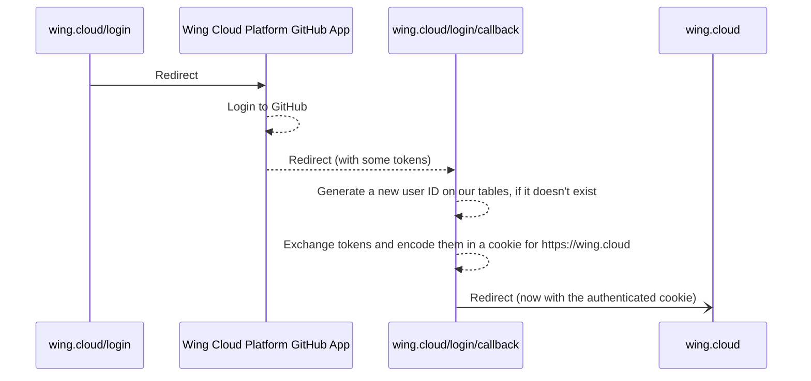
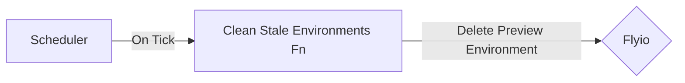

# #3696 - Wing Cloud Preview Environments

- **Author(s)**: @ainvoner, @skyrpex
- **Submission Date**: 2023-08-03
- **Stage**: Proposal
- **Stage Date**: 2023-08-03

This document describes the Wing Cloud Preview Environments feature.

## Introduction

The **Wing Cloud Preview Environments** project is designed to achieve two key objectives. Firstly, it aims to offer a preview environment solution for those interested in using winglang.
Secondly, it seeks to enhance the winglang ecosystem and its toolchain by building a production application using the language.

## Requirements

Wing Cloud users can build and deploy Wing applications to an ephemeral (simulated) environment and use the Wing Console UI to interact with it.
Automatically run tests on the preview environment once created and provide a UI for viewing the test results.
Allow developers to collaborate with their teammates using a shared environment.
Seamlessly integrating with GitHub.

### Sign Up to Wing Cloud

1. Goto https://wing.cloud and click on sign up.
2. sign up to Wing Cloud using GitHub authentication.

### Sign In to Wing Cloud

1. Goto https://wing.cloud and click on sign in.
2. If a developer was already signed in before, he will be automatically signed in to Wing Cloud.

### Authentication and Authorization

1. Wing Cloud Preview Environments will use GitHub for authentication and authorization.
2. Developers will be able to install Wing Cloud Preview Environments on a repository only if they have the GitHub permissions.
3. Developers will be able to create a PR with a preview environment only if they have the necessary GitHub permissions to the repository **and** their GitHub user is signed up to Wing Cloud.
4. Everyone can view a preview environment if they have the url.

### Wing Cloud Preview Environments Developer Experience

A developer using winglang has the capability to integrate Wing Cloud Preview Environments with their repository.

#### Installation

In order to use Wing Cloud Preview Environments, you should sign in to Wing Cloud.
The installation process is straightforward using GitHub application:

1. Goto https://wing.cloud and log in
2. Goto https://wing.cloud/preview and Click on "Deploy with Wing Cloud"
3. Complete GitHub application authentication.
4. Grant repository access permission.
5. You are now ready to use Wing Cloud Preview Environments.
6. A welcome email will be sent to you with additional information and links to documentation.

#### Preview Environment for production branch

For the production branch, there is a single preview environment that will constantly be up-to-date with the latest code committed.
A link to the preview environment is available in the repository main page ("About" section).
Production branch environment url structure is: `https://<gh-repository>-<gh-branch>-<entry-point>.wingcloud.app`

#### Preview Environments for Pull Requests

Upon each creation of a pull request an automatic comment will be added to the PR and will guide the developer to dedicated preview environments.
provide a streamlined process for updating a pull request preview environment, each PR code changes will redeploy the preview environment and also will:

1. provide a real-time build and deployment status updates
2. each entry point will have a seperated preview environment
3. ensure a consistent and unique url for each preview environment. The url structure: `https://<gh-repository>-<gh-branch>-<entry-point>-<pr-number>.wingcloud.app`
4. provide the ability to download the preview environment deployment logs for debugging purposes in case of failure, logs urls structure is: `https://wing.cloud/gh-account/gh-repo/gh-branch/entry-file/logs/`

PR comment example:

| Entry Point     | Status                                                                                   | Preview                                                                          | Updated (UTC)        |
| --------------- | ---------------------------------------------------------------------------------------- | -------------------------------------------------------------------------------- | -------------------- |
| main.w          | ✅ Ready ([logs](https://wing.cloud/gh-account/gh-repo/gh-branch/main/logs/))            | [Visit Preview](https:/gh-repository-gh-branch-3312-main.wing.cloud.app)         | Jul 31, 2023 8:01am  |
| another.main.w  | ✅ Ready ([logs](https://wing.cloud/gh-account/gh-repo/gh-branch/another-main/logs/))    | [Visit Preview](https:/gh-repository-gh-branch-3312-another-main.wing.cloud.app) | Jul 30, 2023 10:01am |
| failed.main.w   | ❌ Failed ([logs](https://wing.cloud/gh-account/gh-repo/gh-branch/entry-file/logs/))     |                                                                                  | Jul 31, 2023 8:01am  |
| building.main.w | 🔄 Building ([logs](https://wing.cloud/gh-account/gh-repo/gh-branch/entry-file/logs/))   |                                                                                  | Jul 31, 2023 8:01am  |
| stale.main.w    | ⏸️ Stale ([lean more](https://wing.cloud/gh-account/gh-repo/gh-branch/entry-file/logs/)) |                                                                                  | Jul 31, 2023 8:01am  |

TBD - tests results per entry point

**Disclaimer**: Developers that have write access and can create PRs but didn't signed-up to Wing Cloud will not be able to create preview environments.
In this case the above comment will contain a direct link for signing up to Wing Cloud.
After signing up, the developer will be able to create a preview environment for the PR and one will be created automatically after the next code change.

#### Multiple Entry Points

A developer can configure multiple entry points in a single PR.
Every `*.main.w` file in the repository will be considered as an entry point and will have a dedicated preview environment.
All preview environments will be available in the PR comment and will be updated upon code changes.

#### Populate Environment with Initial Data

Out of scope for this project.

#### Automatically Running Tests

Upon PR creation and code changes, Wing Cloud Preview Environments will automatically run all tests defined for each entry point.
For each test run, a new simulator will be created and will be destroyed upon test completion.
The test results will be available in the PR comment for each entry point.

#### Running Tests Manually

Running tests on your environment is easy using the Wing Console tests UI.
Each test will reload the simulator to create a clean environment.

Once the test is over it will **not** clean up the simulator data, so you can debug the environment and share outputs with your teammates.

#### User-Controlled Environments termination

Closing a PR will terminate the corresponding preview environments.
The PR comment will indicate the termination of each preview environment and the urls won't be valid anymore.

#### Self-Cleaning Environments Mechanism

To ensure efficient resource utilization:

1. Preview environments associated with stale PRs (without access or code changes for over 30 days) will automatically deactivate.
2. The PR's preview environment comment will indicate its inactive status.
3. Changes in code will trigger redeployment for all related preview environments in this PR.

### Analytics and Logs

To improve the product we are collecting data and monitoring the system.

1. We collect preview environments usage analytics only. We won't collect anything about your code and project.
2. OpenTelemetry is used for collecting metrics, logs, traces.
3. Datadog is used for monitoring the system.

### Documentation

Developers reading our docs can easily sign up to Wing Cloud and start using its Preview Environments feature in their repository.
In our docs we have the following information:

1. What is Wing Cloud Preview Environments
2. Getting started instructions
3. How can I configure multiple entry points
4. Populate environment with initial data
5. Running tests

### Security

1. The preview environments shouldn’t be able to access files from other preview environments
2. Only Wing Cloud signed up developers with write access to the repository can create preview environments

## NON Requirements

1. Preview environments will require authentication to view.
2. Assign users to Teams.
3. enable preview environments viewers to add comments in the environment itself

## Technical Design

### Technology

- https://winglang.io for the infrastructure (although it may prove a challenge due to time constrains)
- AWS for the infrastructure
- Node.js 18 for the backend
- https://github.com/probot/probot for the GitHub integration
- https://fly.io for the preview environments
- https://react.dev/ for the frontend

### Architecture

- A GitHub app
- A Cloud.Function that will be triggered by GitHub events, such as `pull_request.synchronize` or `pull_request.closed`
- A Flyio account to deploy the preview environments
- A Cloud.Table to store different data:
  - The registered users
  - The connected GitHub repositories
  - The related Flyio projects and environments

#### Process: Sign Up and Sign In

We can use the GitHub app as an OAuth provider for Wing Cloud. A set of pages will be needed:

> **Important Note:** Since we don't ask for information during the sign up process, both the sign up and sign in flows are the same.

#### Process: Authentication and Authorization

The website https://wing.cloud will use a secure HTTP-only cookie that safely encodes a JWT containing the Wing Cloud user ID. We could use the Github user ID, but we may want to support other authentication providers in the future.

Every possible interaction with the Wing Cloud will be through an API. Any request to the API will be authenticated using this cookie. The API will then use the user ID to check if the user has the necessary permissions to perform the action.

Since we want to go minimal, we can use the GitHub API and the user permissions to the repository as the authorization mechanism. Beware the GitHub API has a [rate limit](https://docs.github.com/en/apps/creating-github-apps/registering-a-github-app/rate-limits-for-github-apps#installation-access-tokens-on-githubcom), so we may want to cache the permissions for a while if we foresee hitting these limits. Also, see the [List collaborators endpoint](https://docs.github.com/en/free-pro-team@latest/rest/collaborators/collaborators?apiVersion=2022-11-28#list-repository-collaborators) for more information on authorization.

#### Process: Processing GitHub Events

A Cloud.Function will listen to GitHub events and will process them. Based on the event, the function will create, update or delete preview environments on Flyio.

Depending on whether GitHub retries events or not, we may want to include a FIFO queue in the middle.

The probot npm package will take care of ensuring the events received are legitimate.

#### Process: Creating Preview Environments

When a GitHub event `pull_request.opened` is received, we will look for `*.main.w` files and create a preview environment for each of them. We will use the Flyio API to create a new project(s) and deploy the code to it (the Flyio specifics may change).

New subdomains will be created for each preview environment:

- `<gh-repository>-<nanoid>.wingcloud.app`
- `<gh-repository>-<gh-branch>-<entry-point>.wingcloud.app`, as an alias of the above, if available. Otherwise, a random ID could be added somewhere, such as in `<gh-repository>-<gh-branch>-<nanoid>-<entry-point>.wingcloud.app`

During this process, we will also create new entries in the Cloud.Table to store the Flyio project ID, the GitHub PR ID, the entry points and whatever unique IDs we generate for every environment. This data is necessary to later resolve the subdomains to the Flyio projects, to update them later, and to delete them.

The technical details on how the subdomain resolution will work at DNS level are still to be determined.

A special comment will be added to the PR with the list of preview environments and their status. The comment will be updated as the preview environments are created.

#### Process: Updating Preview Environments

When a GitHub event `pull_request.synchronize` is received, we will look again for `*.main.w` files. We will then update the Flyio project(s) with the new code.

New entrypoints will require new preview environments to be created. We will use the same process as the one described in the previous section.

Entrypoints that aren't there anymore will require the preview environment to be deleted. We will use the same process as the one described in the next section.

The entries in the Cloud.Table will be updated to update the last time the preview environment was updated.

The special comment in the PR will be updated accordingly.

#### Process: Deleting Preview Environments

When a GitHub event `pull_request.closed` is received, we will stop every Flyio project associated with the PR. We will also update the entries in the Cloud.Table to reflect this status.

The special comment in the PR will be updated accordingly.

#### Process: Deleting Stale Environments

A scheduler will run periodically and will delete stale environments (in a process similar to the one above).

