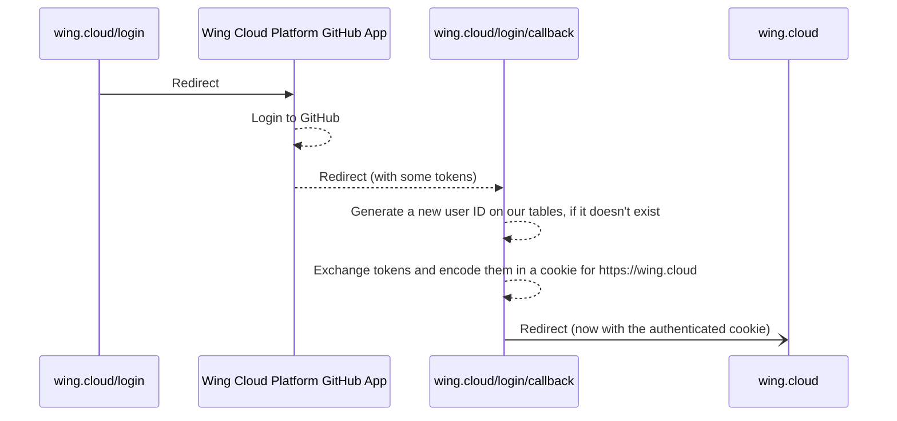
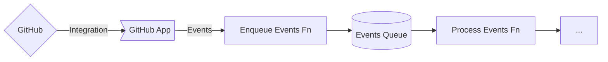
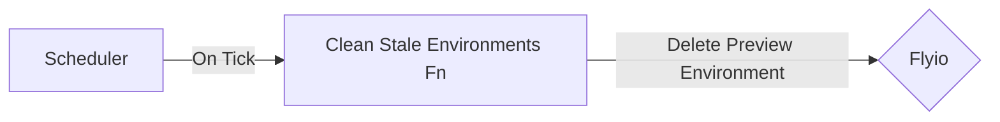

# #3696 - Wing Cloud Preview Environments

- **Author(s)**: @ainvoner, @skyrpex
- **Submission Date**: 2023-08-03
- **Stage**: Proposal
- **Stage Date**: 2023-08-03

This document describes an MVP for the first Wing Cloud product - Wing Cloud Preview Environments.

## Introduction

The **Wing Cloud Preview Environments** is the first Wing Cloud product.
Wing Cloud Preview Environments will also be the first production grade product written in Wing language.

## Requirements

Wing Cloud users can build and deploy Wing applications to an ephemeral (simulated) environment and use the Wing Console UI to interact with it.
Once a preview environment is created, tests will be executed automatically and the results will be available in the preview environment dedicated comment in GitHub.
Each preview environment will have a unique url which enable developers to work together on a shared environment.
Wing Cloud Preview Environments will be integrated with GitHub and will be available as a GitHub application.

### Developer Experience

#### Sign In to Wing Cloud

1. On https://wing.cloud website click on sign in.
2. Authenticate using your GitHub account.
3. If you where already signed in you will be redirected to the wing cloud dashboard page automatically.

#### Redirect to Sign In process from a Preview Environment url

1. If you try to access a preview environment url while you are not signed in to Wing Cloud (from the PR comment for example), you will be temporarily redirected to the Wing Cloud sign in page.
2. Once singed in, you will be redirected to the preview environment url.

#### Authentication and Authorization

1. Wing Cloud will use GitHub for authentication and authorization.
2. Developers will be able to install Wing Cloud application in a GitHub repository only if they have the needed GitHub permissions.
3. Preview environments will be created automatically for all developers that can create a PR in a repository.
4. Only developers that are **signed-in to Wing Cloud** and **have access to the preview environment's repository** can view preview environment created for that repository.
5. If an unsigned user attempts to access a preview environment, they will be directed to the Wing Cloud sign-in page in order to complete the sign-in process before proceeding.
6. If a Wing Cloud singed-in user that doesn't have access to the preview environment's repository attempts to access a preview environment, they will be directed to the Wing Cloud dashboard page and will be notified that they don't have access to the preview environment's repository.

#### Wing Cloud Dashboard

1. Once signed in, you will be redirected to the Wing Cloud dashboard page.
2. From Wing Cloud dashboard you can install Wing Cloud application on any of your repositories.
3. Wing Cloud dashboard page display a list of all the repositories that you have installed Wing Cloud application on.
4. For each repository, there is a list of all the preview environments.
5. In order to see a preview environment, click on the preview environment url.

#### Installation of Wing Cloud application

In order to use Wing Cloud Preview Environments, you should sign in to Wing Cloud and install Wing Cloud application in your GitHub account and repository.
The installation process is straightforward using GitHub application:

1. Goto https://wing.cloud and sign in
2. If you are already signed in, you will be redirected to the Wing Cloud dashboard page https://wing.cloud/dashboard
3. In https://wing.cloud/dashboard, Click on "Deploy with Wing Cloud"
4. Complete GitHub application authentication.
5. Grant the repositories you want to have preview environments for, access permission.
6. You are now ready to use Wing Cloud Preview Environments.
7. A welcome email will be sent to you with additional information and links to documentation.

#### Preview Environment for production branch

For the repository production branch, there is a single preview environment that will constantly be up-to-date with the latest code committed.
A link to the preview environment is available in the repository main page ("About" section).
Production branch environment url structure is: `https://<gh-repository>-<gh-branch>-<entry-point>.wingcloud.app`
Once the installation of the Wing Cloud application is completed, an initial preview environment will be created and will be available in the repository main page.

#### Preview Environments for Pull Requests

Upon each creation of a pull request an automatic comment will be added to the PR and will guide the developer to dedicated preview environments.
provide a streamlined process for updating a pull request preview environment, each PR code changes will redeploy the preview environment and will also:

1. Provide a real-time build and deployment status updates
2. While preview environment is being updated, the user that is currently using the environment will be notified and will be able to refresh the page to get the latest changes.
3. Each entry point will have a seperated preview environment
4. Ensure a consistent and unique url for each preview environment. The url structure: `https://<gh-repository>-<gh-branch>-<entry-point>.wingcloud.app`
5. Provide the ability to download the preview environment deployment logs for debugging purposes in case of failure, logs urls structure is: `https://<gh-repository>-<gh-branch>-<entry-point>.wingcloud.app/logs/`

PR comment example:

| Entry Point     | Status                                                                                           | Preview                                                                     | Tests                                                                                                                                                                                    | Updated (UTC)        |
| --------------- |--------------------------------------------------------------------------------------------------| --------------------------------------------------------------------------- |------------------------------------------------------------------------------------------------------------------------------------------------------------------------------------------|----------------------|
| main.w          | ✅ Ready ([logs](https://<gh-repository>-<gh-branch>-main.wingcloud.app/logs/build))              | [Visit Preview](https:/gh-repository-gh-branch-main.wing.cloud.app)         | ✅  [sanity](https://<gh-repository>-<gh-branch>-main.wingcloud.app/logs/tests/sanity)   ✅ [E2E](https://<gh-repository>-<gh-branch>-main.wingcloud.app/logs/tests/E2E)                | Jul 31, 2023 8:01am  |
| another.main.w  | ✅ Ready ([logs](https://<gh-repository>-<gh-branch>-another-main.wingcloud.app/logs/build))      | [Visit Preview](https:/gh-repository-gh-branch-another-main.wing.cloud.app) | ✅ [sanity](https://<gh-repository>-<gh-branch>-another-main.wingcloud.app/logs/tests/sanity)   ❌ [E2E](https://<gh-repository>-<gh-branch>-another-main.wingcloud.app/logs/tests/E2E) | Jul 30, 2023 10:01am |
| failed.main.w   | ❌ Failed ([logs](https://<gh-repository>-<gh-branch>-failed-main.wingcloud.app/logs/build))      |                                                                             |                                                                                                                                                                                          | Jul 31, 2023 8:01am  |
| building.main.w | 🔄 Building ([logs](https://<gh-repository>-<gh-branch>-building-main.wingcloud.app/logs/build)) |                                                                             |                                                                                                                                                                                          | Jul 31, 2023 8:01am  |
| stale.main.w    | ⏸️ Stale ([lean more](https://<gh-repository>-<gh-branch>-stale-main.wingcloud.app/logs/build))  |                                                                             |                                                                                                                                                                                          | Jul 31, 2023 8:01am  |

#### Preview Environment Environment Variables (Secrets)

Wing Cloud Preview Environments support environment variables (secrets) that can be used in the code.
Environment variables are being set at the repository level and are available for all preview environments.
Adding, updating and removing environment variables can be done from the Wing Cloud CLI:

`wingcloud -repository <my-repo> env add <key> <value>`

#### PR With Multiple Entry Points

There is a support for multiple entry points in a single PR.
Every `*.main.w` file in the repository will be considered as an entry point and will have a dedicated preview environment.
All preview environments will be available in the PR comment and will be updated upon code changes.

#### Run Tests Automatically Upon PR Creation and Code Changes

Upon PR creation and code changes, Wing Cloud Preview Environments will automatically run all tests defined for each entry point.
For each test run, a new simulator will be created and will be destroyed upon test completion.
The test results will be available in the PR comment for each entry point with links to the tests logs (`https://<gh-repository>-<gh-branch>-<entry-point>.wingcloud.app/logs/tests/<test-name>`)

#### Running Tests Manually From Wing Console

Running tests on your environment is easy using the Wing Console tests UI.
Each test will reload the simulator to create a clean environment.

Once the test is over it will **not** clean up the simulator data, so you can debug the environment and share outputs with your teammates.

#### User-Controlled Environments termination

Closing a PR will terminate the corresponding preview environments.
The PR comment will indicate the termination of each preview environment and the urls won't be valid anymore.

#### Self-Cleaning Environments Mechanism

To ensure efficient resource utilization:

1. Preview environments associated with stale PRs (without access or code changes for over 30 days) will automatically deactivate.
2. The PR's preview environment comment will indicate its inactive status.
3. Changes in code will trigger redeployment for all related preview environments in this PR.

### Analytics and Logs

To improve the product we are collecting data and monitoring the system.

1. We collect preview environments usage analytics only. We won't collect anything about your code and project.
2. OpenTelemetry is used for collecting metrics, logs, traces.
3. Datadog is used for monitoring the system.

### Documentation

Developers reading our docs can easily sign up to Wing Cloud and start using its Preview Environments feature in their repository.
In our docs we have the following information:

1. What is Wing Cloud Preview Environments
2. Getting started instructions
3. How can I configure multiple entry points
4. Populate environment with initial data
5. Running tests

### Security

1. Preview environments shouldn’t be able to access files from other preview environments.
2. Only Wing Cloud signed up developers with access to the repository can view preview environments created for this repository.

## Non-Requirements
1. password protected preview environments.
2. wing configuration file support. (for stating a specific wing version, entry points, etc.)
3. update PR comment with tests results triggered from the console.
4. User management
    - each singed in user has an account in wing cloud
    - each account can create a team and invite other users (accounts) to the team
    - each account can have multiple repositories
    - each team can have multiple repositories
    - each account in a team has access to all the team repositories
    - dashboard and user management ui
5. enable preview environments viewers to add comments in the environment.
6. populate Environment with Initial Data
7. Allow users to define specific environment machine type / configuration (cpu, memory, etc.)

## Technical Details

### Technology

- https://winglang.io for the infrastructure
- AWS for the infrastructure
- Node.js 18 for the backend
- https://github.com/probot/probot for the GitHub integration
- https://fly.io for the preview environments
- https://react.dev/ for the frontend

### High Level Architecture

- A GitHub app
- A Cloud.Function that will be triggered by GitHub events, such as `pull_request.synchronize` or `pull_request.closed`
- A Flyio account to deploy the preview environments
- A Cloud.Table to store different data:
    - The registered users
        - GH access token
        - User ID
    - The related Flyio projects and environments
- Deployment and tests logs can be saved in the preview environment server and can be served
- A Cloud.Scheduler to run the self-cleaning mechanism

### Authentication and Authorization

1. When a user sign in we will save their GitHub account details in the database.
2. Each preview environment will have to authenticate the user using GitHub before allowing access.
   - check if the user is signed in to Wing Cloud (cookie, jwt)
   - if not, redirect to Wing Cloud login page and then redirect back to the preview environment
   - check if the signed-in user has access to the repository of the preview environment
   - if not, redirect to Wing Cloud dashboard and show an informative message

The website https://wing.cloud will use a secure HTTP-only cookie that safely encodes a JWT containing the Wing Cloud user ID. We could use the GitHub user ID, but we may want to support other authentication providers in the future.

Every possible interaction with the Wing Cloud will be through an API. Any request to the API will be authenticated using this cookie. The API will then use the user ID to check if the user has the necessary permissions to perform the action.

We can use the GitHub API and the user permissions to the repository as the authorization mechanism. Beware the GitHub API has a [rate limit](https://docs.github.com/en/apps/creating-github-apps/registering-a-github-app/rate-limits-for-github-apps#installation-access-tokens-on-githubcom), so we may want to cache the permissions for a while if we foresee hitting these limits. Also, see the [List collaborators endpoint](https://docs.github.com/en/free-pro-team@latest/rest/collaborators/collaborators?apiVersion=2022-11-28#list-repository-collaborators) for more information on authorization.

### Sign Up and Sign In

We can use the GitHub app as an OAuth provider for Wing Cloud. A set of pages will be needed:

> **Important Note:** Since we don't ask for information during the sign-up process, both the sign-up and sign in flows are the same.

### Wing Cloud Dashboard

1. get user repositories from GitHub by using the GitHub API and the user's access token we have in our DB
2. filter repositories that have Wing Cloud application installed.
3. for each repository, get all preview environments.
4. there is no need to store user -> repositories mapping in our DB, we can get it from GitHub API.
5. also there is no need to store repository -> preview environments mapping in our DB, we can get it from GitHub API.

### Processing GitHub Events

A Cloud.Function will listen to GitHub events and will process them. Based on the event, the function will create, update or delete preview environments on Flyio.

Depending on whether GitHub retries events or not, we may want to include a FIFO queue in the middle.

The probot npm package will take care of ensuring the events received are legitimate.

### Creating Preview Environments

When a GitHub event `pull_request.opened` is received, we will look for `*.main.w` files and create a preview environment for each of them. We will use the Flyio API to create a new project(s) and deploy the code to it (the Flyio specifics may change).
Before building the project we will have to inject environment variables set by the user (need to be taken from our DB).
New subdomains will be created for each preview environment:

- `<gh-repository>-<nanoid>.wingcloud.app`
- `<gh-repository>-<gh-branch>-<entry-point>.wingcloud.app`, as an alias of the above, if available. Otherwise, a random ID could be added somewhere, such as in `<gh-repository>-<gh-branch>-<nanoid>-<entry-point>.wingcloud.app`

During this process, we will also create new entries in the Cloud.Table to store the Flyio project ID, the GitHub PR ID, the entry points and whatever unique IDs we generate for every environment. This data is necessary to later resolve the subdomains to the Flyio projects, to update them later, and to delete them.

The technical details on how the subdomain resolution will work at DNS level are still to be determined.

A special comment will be added to the PR with the list of preview environments and their status. The comment will be updated as the preview environments are created.

### Preview Environment Environment Variables (Secrets)

wingcloud CLI - TBD

### Updating Preview Environments

When a GitHub event `pull_request.synchronize` is received, we will look again for `*.main.w` files. We will then update the Flyio project(s) with the new code.

New entrypoints will require new preview environments to be created. We will use the same process as the one described in the previous section.

Entrypoints that aren't there anymore will require the preview environment to be deleted. We will use the same process as the one described in the next section.

The entries in the Cloud.Table will be updated to update the last time the preview environment was updated.

The special comment in the PR will be updated accordingly.

### Deleting Preview Environments

When a GitHub event `pull_request.closed` is received, we will stop every Flyio project associated with the PR. We will also update the entries in the Cloud.Table to reflect this status.

The special comment in the PR will be updated accordingly.

### Deleting Stale Environments

A scheduler will run periodically and will delete stale environments (in a process similar to the one above).

