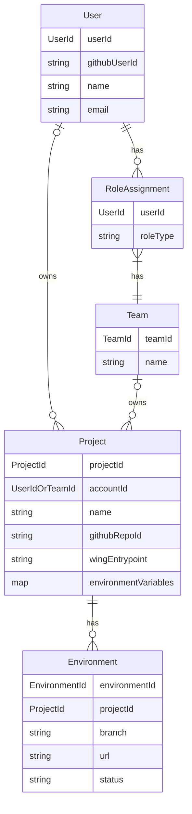
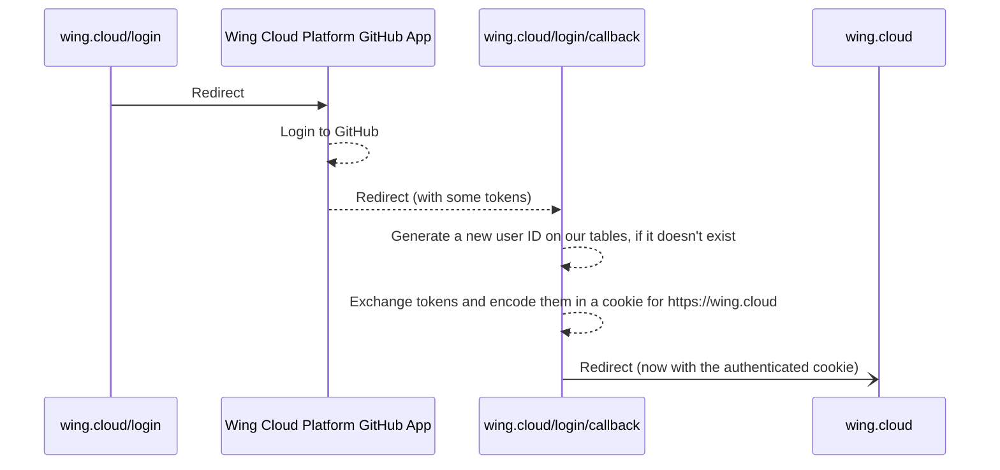
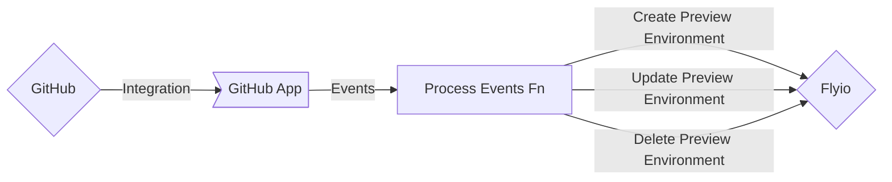
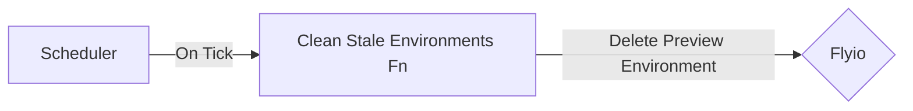

# #3696 - Wing Cloud Preview Environments

- **Author(s)**: @ainvoner, @skyrpex
- **Submission Date**: 2023-08-03
- **Stage**: Proposal
- **Stage Date**: 2023-08-03

This document describes an MVP for the first Wing Cloud product - Wing Cloud Preview Environments.

## Introduction

**Preview Environments** are the first feature of Wing Cloud. It will also be the first production grade product written in Wing language.

## Requirements

Wing Cloud users can build and deploy Wing applications to an ephemeral environment that uses the Wing Simulator platform, and use the Wing Console UI to interact with it.
Once a preview environment is created, tests will be executed automatically and the results will be available in the preview environment dedicated comment in GitHub.
Each preview environment will have a unique URL which enable developers to work together and share with external customers as needed.

Wing Cloud will be integrated with GitHub.

### Wing Cloud User Experience

#### Sign-In to Wing Cloud (#1)

1. On https://wing.cloud website click on sign in.
2. Authenticate using your GitHub account.
3. If you were already signed in, you will see the Wing Cloud dashboard (under https://wing.cloud directly).

#### Redirect to sign-in process from a Preview Environment URL (#2)

1. If you try to access a preview environment URL while you are not signed in to Wing Cloud (from the PR comment for example), you will be temporarily redirected to the Wing Cloud sign-in flow.
2. Once singed in, you will be redirected to the preview environment URL.

#### Wing Cloud Dashboard for Signed-In Users (#3)

1. Once signed in, you will automatically see Wing Cloud for signed-in users (under https://wing.cloud directly).
2. You can install Wing Cloud GitHub application in your GitHub acocunt.
3. You can see and manage all your projects and teams.
4. You will see all preview environments associated with your personal account and teams you are member in.
5. In order to see a preview environment, just click on the preview environment URL from the list of all your preview environments.

#### Install Wing Cloud GitHub application (#4)

In order to use Wing Cloud Preview environments feature in your repository, you should sign in to Wing Cloud and install the Wing Cloud application in your GitHub account and repository.
The installation process is straightforward using a GitHub application:

1. After signing-in to https://wing.cloud, click on "Install Wing Cloud"
2. Complete GitHub application authentication and installation.
3. You are now ready to use Wing Cloud.
4. A welcome email will be sent to you with additional information and links to documentation.

#### Create a new personal Project (#5)

1. To create a new project, click on "New Project" under "Personal Account".
2. Choose between the GitHub repositories that you have access to.
3. Define your secret values.
4. Make sure there's a `main.w` file in the root of the repository.
5. Click on "Deploy".
6. You'll be redirected to your new project's page (https://wing.cloud/-user/-project).

#### Create a new Team (#6)

1. Click on "New Team".
2. Write a team name.
3. Optionally, invite other Wing Cloud users to the team (by GitHub user ID).

#### Create a new team Project (#7)

1. Click on "New Project" under the team of your choice.
2. Choose between the GitHub repositories that you have access to.
3. Define your secret values.
4. Make sure there's a `main.w` file in the root of the repository.
5. Click on "Deploy".
6. You'll be redirected to your new project's page (https://wing.cloud/-team/-project).

#### Preview Environment for production branch (#8)

For the repository production branch, there is a single preview environment that will constantly be up-to-date with the latest code committed.
A link to the preview environment is available in the repository main page ("About" section).
Production branch environment url structure is: `https://wing.cloud/-account/-project/-branch`
Once the installation of the Wing Cloud application is completed, an initial preview environment will be created and will be available in the repository main page.

#### Preview Environments for Pull Requests (#9)

Upon each creation of a pull request an automatic comment will be added to the PR and will guide the developer to a dedicated preview environment.
Provide a streamlined process for updating a pull request preview environment, each code changes in a PR will redeploy the preview environment and will also:

1. Provide a real-time build and deployment status updates
2. While preview environment is being updated, the user that is currently using the environment will be notified and will be able to refresh the page to get the latest changes.
3. Ensure a consistent and unique url for each preview environment. The url structure: `https://wing.cloud/-account/-project/-branch`
4. Provide the ability to download the preview environment deployment logs for debugging purposes in case of failure, logs urls structure is: `https://wing.cloud/-account/-project/-branch/logs/build/`

PR comment example (only one entry point will be supported):

| Entry Point     | Status                                                                           | Preview                                                       | Tests                                                                                                                                                  | Updated (UTC)       |
| --------------- | -------------------------------------------------------------------------------- | ------------------------------------------------------------- | ------------------------------------------------------------------------------------------------------------------------------------------------------ | ------------------- |
| main.w          | ✅ Ready ([logs](https://wing.cloud/-account/-project/-branch/logs/build/))      | [Visit Preview](https://wing.cloud/-account/-project/-branch) | ✅ [sanity](https://wing.cloud/-account/-project/-branch/logs/tests/sanity)   ✅ [E2E](https://wing.cloud/-account/-project/-branch/logs/tests/E2E) | Jul 31, 2023 8:01am |
| failed.main.w   | ❌ Failed ([logs](https://wing.cloud/-account/-project/-branch/logs/build/))     |                                                               |                                                                                                                                                        | Jul 31, 2023 8:01am |
| building.main.w | 🔄 Building ([logs](https://wing.cloud/-account/-project/-branch/logs/build/))   |                                                               |                                                                                                                                                        | Jul 31, 2023 8:01am |
| stale.main.w    | ⏸️ Stale ([lean more](https://wing.cloud/-account/-project/-branch/logs/build/)) |                                                               |                                                                                                                                                        | Jul 31, 2023 8:01am |

#### Preview Environment Environment Variables (Secrets) (#10)

The project management dashboard will include a section to manage the secrets of the project. These secrets will be available during the Wing compilation.

#### Run Tests Automatically Upon PR Creation and Code Changes (#11)

Upon PR creation and code changes, Wing Cloud Preview Environments will automatically run all tests defined for the entry point.
For each test run, a new simulator will be created and will be destroyed upon test completion.
The test results will be available in the PR comment with links to the tests logs (`https://wing.cloud/-account/-project/-branch/logs/tests/<test-name>`)

#### Running Tests Manually From Wing Console (#12)

Running tests on your environment is easy using the Wing Console tests UI.
Each test will reload the simulator to create a clean environment.

Once the test is over it will **not** clean up the simulator data, so you can debug the environment and share outputs with your teammates.

#### User-Controlled Environments termination (#13)

Closing a PR will terminate the corresponding preview environments.
The PR comment will indicate the termination of each preview environment and the URLs won't be valid anymore.

#### Self-Cleaning Environments Mechanism (#14)

To ensure efficient resource utilization:

1. Preview environments associated with stale PRs (without access or code changes for over 30 days) will automatically deactivate.
2. The PR's preview environment comment will indicate its inactive status.
3. Changes in code will trigger redeployment for all related preview environments in this PR.

### Analytics and Logs (#15)

To improve the product we are collecting data and monitoring the system.

1. We collect preview environments usage analytics only. We won't collect anything about your code and project.
2. OpenTelemetry is used for collecting metrics, logs, traces.
3. Datadog is used for monitoring the system.

### Documentation (#16)

Developers reading our docs can easily sign up to Wing Cloud and start using its Preview Environments feature in their repository.
In our docs we have the following information:

1. What is Wing Cloud Preview Environments
2. Getting started instructions
3. How can I configure multiple entry points
4. Populate environment with initial data
5. Running tests

### Security (#17)

1. Preview environments shouldn’t be able to access files from other preview environments.
2. Only Wing Cloud signed up developers with access to the repository can view preview environments created for this repository.

## Non-Requirements

1. password protected preview environments.
2. wing configuration file support. (for stating a specific wing version, entry points, etc.)
3. update PR comment with tests results triggered from the console.
4. enable preview environments viewers to add comments in the environment.
5. populate Environment with Initial Data
6. Allow users to define specific environment machine type / configuration (cpu, memory, etc.)
7. Support multiple entry points in a single PR:

   There is a support for multiple entry points in a single PR.
   Every `*.main.w` file in the repository will be considered as an entry point and will have a dedicated preview environment.
   All preview environments will be available in the PR comment and will be updated upon code changes.

## Technical Details

### Entity Relationship Diagram

### Roles

| Role    | Manage Projects | Manage Users | Manage Billing | Manage Settings | View Projects | View Users | View Billing | View Settings | View Preview Environments |
| ------- | --------------- | ------------ | -------------- | --------------- | ------------- | ---------- | ------------ | ------------- | ------------------------- |
| Owner   | ✅              | ✅           | ✅             | ✅              | ✅            | ✅         | ✅           | ✅            | ✅                        |
| Admin   | ✅              | ✅           | ✅             | ✅              | ✅            | ✅         | ✅           | ✅            | ✅                        |
| Member  | ❌              | ❌           | ❌             | ❌              | ✅            | ✅         | ✅           | ✅            | ✅                        |
| Billing | ❌              | ❌           | ✅             | ❌              | ✅            | ✅         | ✅           | ✅            | ✅                        |

Notes:

- Only an owner can delete a team
- The billing details will be visible to all members but will be mangled (ex, only the last 4 digits of the credit card will be visible)

### Technology

- https://winglang.io for the infrastructure
- AWS for the infrastructure
- Node.js 18 for the backend
- https://github.com/probot/probot for the GitHub integration
- https://fly.io for the preview environments
- https://react.dev/ for the frontend

### High Level Architecture

- A GitHub app
- A Cloud.Function that will be triggered by GitHub events, such as `pull_request.synchronize` or `pull_request.closed`
- A fly.io account to deploy the preview environments
- A Cloud.Table to store different data:
  - The registered users
    - GH access token
    - User ID
  - The fly.io projects, machines and relations to their preview environments URLs
- Deployment and tests logs can be saved in the preview environment server and can be served
- A Cloud.Scheduler to run the self-cleaning mechanism
- Wing Cloud web app will serve the console web application and use console servers run on fly.io machines

### Wing Cloud website

https://wing.cloud website should still be a webflow site until user sign in.
For signed-in users https://wing.cloud web app is a React app.
need to use a reverse proxy as we have in our playground/learn/docs sites.

### Authentication

1. When a user sign in we will save their GitHub account details in the database
2. The website https://wing.cloud will use a secure HTTP-only cookie that safely encodes a JWT containing the Wing Cloud user ID
3. Every interaction with the Wing Cloud will be through an API. Any request to the API will be authenticated using this cookie. The API will then use the user ID to check if the user has the necessary permissions to perform the action
   - Additional security measures will be taken to prevent CSRF attacks

### Authorization

1. Only signed in users will be available to navigate to preview environments. Wing Cloud will check the user permissions to the project and will allow access only to users that are members of the project.
2. Developers will be able to install Wing Cloud application in a GitHub repository only if they have the needed GitHub permissions
3. Preview environments will be created automatically for all developers that can create a PR in a repository

### Sign Up and Sign In

We can use the GitHub app as an OAuth provider for Wing Cloud. A set of pages will be needed:

> **Important Note:** Since we don't ask for information during the sign-up process, both the sign-up and sign in flows are the same.

### Wing Cloud Web Application

1. get user repositories from GitHub by using the GitHub API and the user's access token we have in our DB
2. filter repositories that have Wing Cloud application installed.
3. for each repository, get all preview environments URLs.
4. we will need to have repository -> preview environments mapping in our DB.
5. there is no need to store user -> repositories mapping in our DB, we can get it from GitHub API.

### Processing GitHub Events

A Cloud.Function will listen to GitHub events and will process them. Based on the event, the function will create, update or delete preview environments on Flyio.

Depending on whether GitHub retries events or not, we may want to include a FIFO queue in the middle.

The probot npm package will take care of ensuring the events received are legitimate.

### Creating Preview Environments

When a GitHub event `pull_request.opened` is received, we will look for `main.w` file and create a preview environment. We will use the Flyio API to create a new project(s) and deploy the code to it (the Flyio specifics may change).
Before building the project we will have to inject environment variables set by the user (need to be taken from our DB).
Each preview environment will have a dedicated route (path) in wing.cloud:

https://wing.cloud/-account/-project/-branch

During this process, we will create new entries in the Cloud.Table to store the Flyio project ID, fly.io server, the GitHub PR ID, preview environment path , the entry points and whatever unique IDs we generate for every environment. This data is necessary to later resolve the subdomains to the Flyio projects, to update them later, and to delete them.

A special comment will be added to the PR with the list of preview environments and their status. The comment will be updated as the preview environments are created.

### Preview Environment Environment Variables (Secrets)

The secrets will be stored in the Cloud.Table and will be injected into the preview environment during the build process.

The secrets in the Cloud.Table will be encrypted using a key stored using a Cloud.Secret.

In the future, we could detect which secrets are necessary for the app to work.

### Updating Preview Environments

When a GitHub event `pull_request.synchronize` is received, we will look again for `*.main.w` files. We will then update the Flyio project(s) with the new code.

New entrypoints will require new preview environments to be created. We will use the same process as the one described in the previous section.

Entrypoints that aren't there anymore will require the preview environment to be deleted. We will use the same process as the one described in the next section.

The entries in the Cloud.Table will be updated to update the last time the preview environment was updated.

The special comment in the PR will be updated accordingly.

### Deleting Preview Environments

When a GitHub event `pull_request.closed` is received, we will stop every Flyio project associated with the PR. We will also update the entries in the Cloud.Table to reflect this status.

The special comment in the PR will be updated accordingly.

### Deleting Stale Environments

A scheduler will run periodically and will delete stale environments (in a process similar to the one above).

