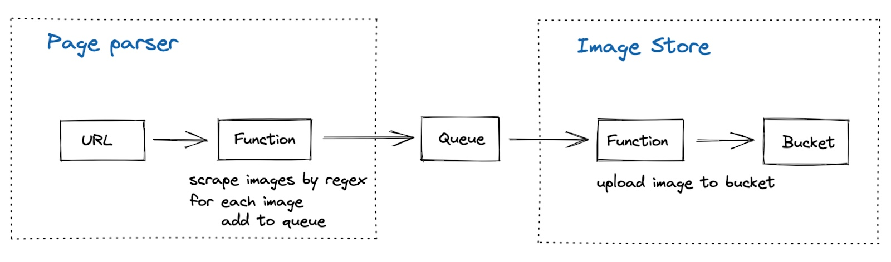
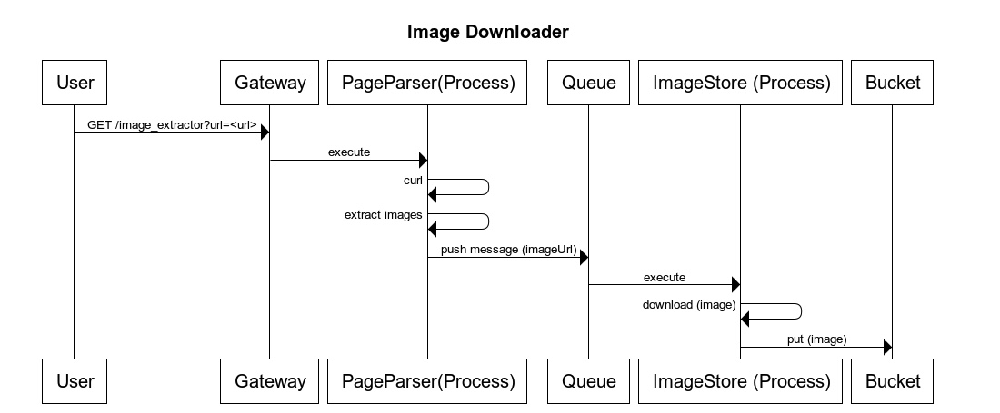
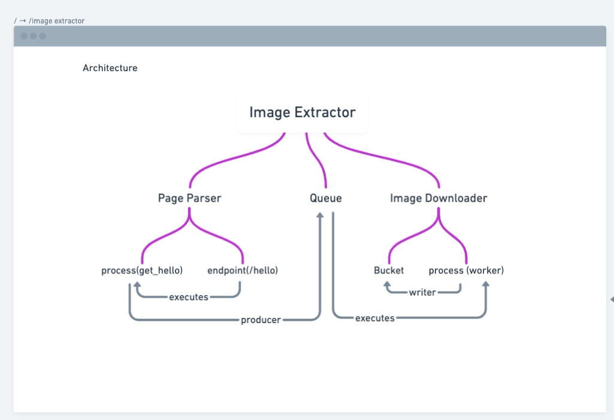
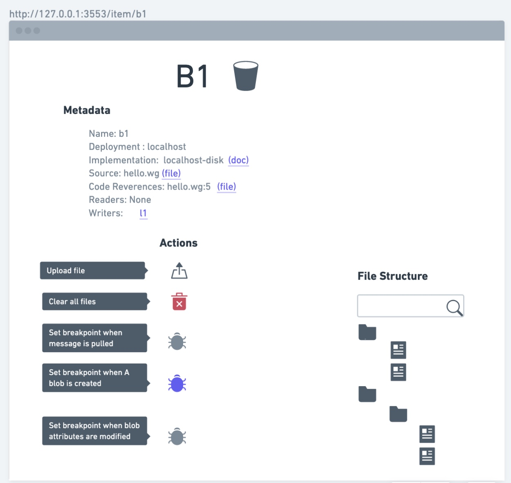

# What is wing V0.1

Wing V0.1 is our first internal milestone, we want to produce a meaningful result that should have the following outcomes

- We start bringing to life our value proposition from a practical standpoint and produce an end to end experience for our target audience
- We all started working together, getting the needed friction inside the product team, working on requirements, code reviews, testing, releasing, celebrating
- We have something to show to the public that will show the value of wing. We can use this in design partnership, investment meetings, presentations, etc…

# V0.1 Goal

Show a cloud oriented development experience that is a **100x** better than what the market has to offer, on a subset of workload types and subset of deployment targets


# Market Ready

What is our definition of market-ready

Ideal outcomes, in order of preference (we will get as far as we can)
- A real product and 5 “hell yes” people using & saying they loving this
- Reduce the perceived feasibility risk by being cloud agnostic 
- Smoke and mirror POC with 5 “hell yes” on it
- A very clear problem statement and 5 “hell yes”

Worst case: any of the above an 0 “hell yes”

# Principals

This is the high level principles we should all agree upon in this project

- **Fake it until you make it** - This is essentially a throwaway code, I expect all parts of the code written to be replaced in the coming year - time to release is extremely important. We need to cut corners where we can deliver and then improve the inner implementation. Having said that, we should not be lazy and write something to throw if we can write something more durable with a similar effort and time frame.
- **Small and meaningful milestones** - Milestones should be a small as possible as long as they are meaningful and when we demo them we leave the room with a real sense of progress and accomplishment
- **Deadlines geneare focus** - We know that teams that have all the time in the world don't complete anything, we use deadlines to make sure we stay focused and lean
- **Don't be blocked on decisions, make them -** There is a huge amount of intuition in this doc both on what is possible and also what is really 100x experience improvement over existing solutions, the reader of this document should treat the author's intuition as lightly helded opinions. Do you want to do something different, just do it (and update @Eyal). We naturally more sensitive for public facing api and user interfaces that should always be reviewed by the relevant stakeholders and owner

# Background &amp; Initial Market Research

This section describes the market trends and the different offering available today for lambda

- [https://www.datadoghq.com/state-of-serverless/](https://www.datadoghq.com/state-of-serverless/)
- [https://docs.aws.amazon.com/lambda/latest/dg/getting-started.html](https://docs.aws.amazon.com/lambda/latest/dg/getting-started.html)

# Competitive Analysis

- Serverless.com
- SAM

# Day 1 product

This is the high level product requirements doc for this project

## Who will we pitch to

Internally for ourselves, externally for design partners and investors

## What will we say

We introduced a 100x better developer experience for lambda services that includes an api gateway, a queue and a bucket where results are stored.

Today, with no Monada's offering: 
  - Developer needs to decide his solution architecture
  - Developer needs a aws/gcp/azure account with permissive privileges to start writing his own service that uses lambda
  - Developer needs to follow getting started guide and creating cloud resources in ways that are not governed by the organization (aws console UI)
  - Developer needs to use other tools (like local stack) and figure out how he can run the his code on a localhost
  - After resources are setup  (in localhost or in the cloud) developer writes the code that will be deployed on these resources 
  - In order for the application to be considered production ready, all cloud configuration should be represented as code (configuration as code) - devops needs to write code the represents this application’s cloud resources (for example by using terraform)

With Monada's offering:
  - Developer needs to design his application architecture 
  - Developer need to install wing executable 
  - Developer needs to learn the few new concepts on top of Javascripts, for instance the concept of a 'constrcut'.
  - Developer code the app logic and update configuration accordingly
  - Developer can run the code locally 
  - Developer can compile the code into aws/gcp/azure and give the devops the bundle of terraform files and javascript files ready to be deployed
  - Devops need to configure CD on the result of the compilation

## Experience

This section is the user experience described as a getting started guide for wing software, it is the public doc that we would have put on our web page if we decide to take V1 public

### Introduction

In this tutorial we will build an app that takes a url from an endpoint and downloads all the images that are correlated to this url

Here is the description of the application architecture:



The underlying construct tree will look like this:

- App
  - Queue
  - PageParser
    - Endpoint
    - Function
  - ImageStore
    - Function
    - Bucket

The flow from end to end will look like this:



### Prerequisites

- **Wing** installed - see the next section
  - This will include Wing Console for local running
  - …
- **Some programming experience.** The code here is pretty simple, but it helps to know something about functions.
- **A tool to edit your code.** Any text editor you have will work fine, better if it supports native javascript development. Most text editors have good support for Javascript. The most popular are VSCode (free)
- **A command terminal.** wing works well using any terminal on Linux and Mac, and on PowerShell or cmd in Windows.

### Install wing

In this section you will learn how to install wing binary that is responsible for running, debugging, compiling, installing packages, testing and help you deploy your services

1. Click the button below to download the Wing installer.
2. Open the package file you downloaded and follow the prompts to install Wing.
 The package installs the wing distribution to /usr/local/wing. The package should put the /usr/local/wing/bin directory in your PATH environment variable. You may need to restart any open Terminal sessions for the change to take effect.
3. Verify that you've installed wing by opening a command prompt and typing the following command:
$ wing version
4. Confirm that the command prints the installed version of Wing.
5. **IT IS TIME TO FLY WITH WING -** got to the next section and write your first wing program

### Wing program

Create the above application

1. Create a hello_wing folder in your local directory

```sh
 $ cd
 $ mkdir hello\_wing
```

2. Create an image\_extractor.w file:
```js
 use cloud

 construct PageParser {
  init(outgoing: cloud.Queue) {
  let image_extractor_endpoint = cloud.Endpoint()
  let page_parser_handler = req => [{
    log(`GET /image_extractor called`)
    // TODO add curl code
    // TODO add parse code
    for (imageUrl in imageUrls) {
      log(`pusing ${imageUrl} into ${outgoing}`)
      await outgoing.push(imageUrl)
    }
    log(`GET /image_extractor done`)
  }]
  image_extractor_endpoint.on_get(`/image_extractor`, page_parser_handler)
 }
}

construct ImageStore {
  init(incoming: cloud.Queue) {
  // this is where we store our files
  let bucket = cloud.Bucket()

  // called for every message in the queue
  let image_store = cloud.Function(imageUrl => [{
  log(`downloading url "${image_url}"`)
  // TODO download imageUrl (output is imageData)
  log(`uploading "${image_url}" to ${bucket}`)
  await bucket.upload(md5(image_url), imageData)
 }])

  incoming.add_worker(image_store)
 }
}

let upload_queue = cloud.Queue()
PageParser(outgoing: upload_queue)
ImageStore(incoming: upload_queue) 
```

### Build for localhost

On this section you will learn how to build you application into a wx file

1. Use the preinstalled wing command to run your code

```sh
$ wing compile --target local ./image_extractor.w 
```

2. A new file was generated as the result of compile image\_extractor.wx
```sh
MacBook-Pro-65:hello_wing ekeren$ ls -la
total 0 
drwxr-xr-x 4 ekeren wheel 128 Jun 27 12:50 .
drwxrwxrwt 12 root wheel 384 Jun 27 12:50 ..
-rw-r--r-- 1 ekeren wheel 382 Jun 27 12:50 image_extractor.w
-rw-r--r-- 1 ekeren wheel 3482 Jun 27 12:50 image_extractor.wx
```

### Run your program with wing developer console

In this section you execute image\_extractor.wx that will be opened by wing developer console which is bundled as part of the wing command

1. Launch wing developer console
```sh
MacBook-Pro-65:hello_wing ekeren$ wing run image_extractor.wx
Launching wing developer console
Provisioning:
 Setting up wing developer console
 Creating localhost bucket b1
 Creating localhost queue q1 
 Creating localhost APIGateway a1, accessible from [http://127.0.0.1:8080](http://127.0.0.1:8080/)
 Creating localhost endpoint e1
 Creating localhost lambda l1
 Creating localhost lambda l2
Binding:
 Endpoint e1 was given execution permissions on l1 
 Lambda l1 was given write permission on queue q1
 Queue q1 was given execution permission on l2Lambda l2 was given write permission on bucket b1
```

1. You should see your wing console launched with the following screen



### See your application in action

In this section you will send a GET request with a url and will launch the above image extractor process

1. On the developer console navigate to the endpoint resource

### Verify that your code worked

On this section you will examine the provisioned bucket and look for the downloaded images

1. Go to [http://127.0.0.1:3553/item/b1](http://127.0.0.1:3553/q13r2)
 You should see something like this:
 
2. Look for `hello.txt` file in the file browser
3. Download the file, and verify that it matches this output

```sh
Sat Jun 11 2022 08:00:40 GMT+0300 (Israel Daylight Time): hello world 
```

### Compile to aws

On this section we will setup github action to deploy your application into production when a branch is merged into master

The output of the compile command will be a machine generated:

- Javascript
- Source map
- Terraform code

### Deploy on AWS

### Compile on Azure

### Deploy on Azure

## Artifacts

- https://whimsical.com/compile-EJ5NnhnKoyADJpwbEj9h2r

# Milestones

## High Level roadmap


## Market Ready


# Technical spec for First Customer Demo Product

**Wing Console Local experience**

[https://docs.google.com/document/d/1krsO5HC-hyj3yyWSwot0x4c6pngDzp\_RA8xcuQutFtI/edit](https://docs.google.com/document/d/1krsO5HC-hyj3yyWSwot0x4c6pngDzp_RA8xcuQutFtI/edit)

1. Wing Console Server (Node server application with a client API)
  1. Client (Wing console -> Wing local server resources communication)
    1. Predefined endpoint: [http://localhost:4000/](http://localhost:4000/)
    2. Path: /resource/:type/:id/:action
    3. Client Api example: (will be developed as a separated private lib)

```js
export interface IBucketClient {
 monitoringData(
   options: IBucketMonitoringDataOptions
 ): Promise<IBucketMonitoringDataResponse>;
 uploadFile(
   options: IBucketUploadFileOptions
 ): Promise<IBucketUploadFileResponse>;
 removeFile(
   options: IBucketRemoveFileOptions
 ): Promise<IBucketRemoveFileResponse>;
}
```

  1. Cloud application
    1. Develop a predefined Image Extractor application with the following architecture: (logical structure and resources types)


      1. Wing Cloud application server implementation example:

```js
main() {
 run apiServer() //express
 
 const imageBucket = new Bucket();
 const imageUploaderFunc = new ImageUploaderFunction(imageBucket);
 const imageQueue = new ImageUploaderQueue(imageUploaderFunc);
 const imageScraperFunc = new ImageScraperFunction(imageQueue);
 
}
 
abstract class IFunction  {
 abstract invoke(payload?: Object): void;
}
 
abstract class IQueue {
 abstract enqueue(obj: Object): void;
 abstract dequeue: Object
}
 
abstract class IBucket {
 abstract uploadFile(file: Object): void;
 abstract downloadFile(filePath: string): Object;
}
 
export class ImageScraperFunction implements IFunction{
 constructor(queue: IQueue) {
   this.queue = queue
 }
 
 const invoke = (image: Object) => {
   this.queue.enqueue(image);
 }
}
 
export class ImageUploaderQueue implements IQueue{
 private Q = queue;
 private subscribers = [{}]; //list
 constructor();
 
 const subscribe = (func: ImageUploaderFunction) {
   subscribers.push({id: '111', func: func})
 }
 
 // add dequeue logic....
 
 const enqueue = (image: Object) => {
   this.queue.enqueue(image);
 }
 
 const dequeue = () => {
   const image = this.Q.dequeue();
   foreach subscribers => sub.invoke(image)
 }
}
 
expect class ImageUploaderFunction implements IFunction {
 
 constructor(bucket: IBucket) {
   this.imagesBucket = bucket;
 }
 
 const invoke = (image: Object) => {
   this.imagesBucket.uploadFile(image)
 }
}
```

 Wing Console
  1. Create an electron application which will take a wx file as an input.
  2. From the wx files, Wing console will
    1. Run the main.js file that will start Wing local cloud server (described above)
    2. Load tree.json file and layout the Cloud application structure
  3. For supported resources: Bucket, Queue, Function, Wing console will have the ability to:
    3. See the resource monitoring data
    4. Run actions on each resource


# TODO

###  Result
  -  what are the business result we want to achieve with this offering
  - ? Installs, users, design partners?

### add our journey to market readiness 

from https://docs.google.com/presentation/d/1a2xwXGcnkqtd6aQBzI0s24QzrmsZ1eYQkXn6N95JPrM/edit#slide=id.g135b0415b34_0_49

### competitive analysis 

### Writing unit test for your code

On this section you will learn how you can test your code using unit tests, without mocking the entire cloud around your code
To be completed after we conclude the actual syntax of

### Setup ad-hoc preview env as part of your Code review process
On this section we will setup github actions project that will build a deploy a preview environment on your aws/gcp account on demand when your create a pull request

### Traceability our service

On this section you will experience wing localhost debugging experience, you will add breakpoints (including in the cloud components, like the queue, bucket, endpoint) and see wing breadcrumbs that describes a request life time. You will also see logs in the context of your traces

### Deploy on GCP/AZure

### Setup Datadog
On this section we will setup datadog monitoring that will allow you to see your services in production and enjoy wing first class citizen tracking, monitoring and debugging

