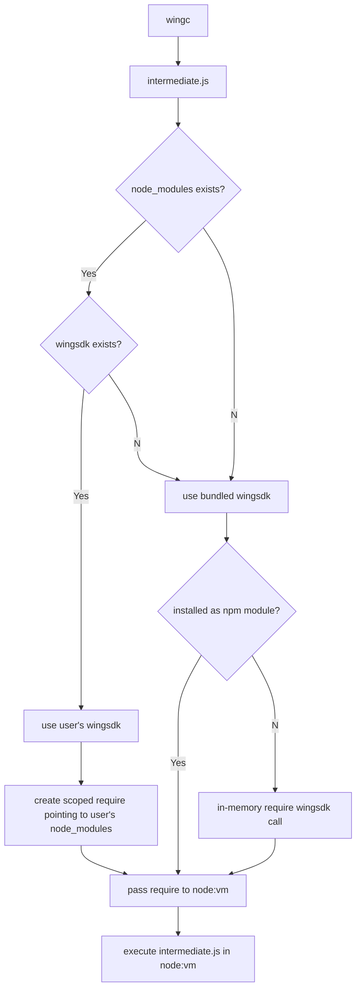

# Wing CLI

Wing CLI is the swiss army knife of Wing toolchain. It is a command line tool
that allows you to interact with the Wing compiler and its simulator.

The CLI is published both as a regular NPM module as well as a standalone binary
for Windows, Linux and MacOS platforms.

## Design Goals

- **Zero Dependency**: CLI must work offline and without any dependencies.
- **Sane Defaults**: CLI must work out of the box without any configuration.
- **Overrideable**: CLI must allow overriding its defaults if user wants to.

  
<small>Design Justification</small>

  It is extremely important for users of the CLI to be able to override all the
  synth time dependencies. These are dependencies that participate in generation
  of artifacts and having it locked down to a specific version is not desirable
  and can be a source of frustration for users.

  Also from software security point of view, the NPM, and CDK ecosystems are not
  exactly known to be stable nor secure. Patching and overriding dependencies is
  a very common pattern. Going against this pattern is punishing power users and
  results in horrible DX.

## Architecture

Wing CLI uses two types of dependencies:

- Build time dependencies: These are dependencies that the user physically does
  not have the option to change. `wingc` is an example of such a dependency.
- Synth time dependencies: These are dependencies that the user can override
  without having to rebuild the CLI. `wingsdk` and `cdktf` come to mind.

Wing CLI invokes `wingc` to compile the Wing source code and then needs to run
`cdktf` to generate the Terraform output. This means, the CLI itself does not
have a dependency on `cdktf` and `wingsdk`, but rather it is a dependency of the
artifacts that `wingc` generates.

In order for the execution of `cdktf` to work, `wingsdk`, `cdktf` and all of its
dependencies must be available in the `node_modules` directory, or at least must
be resolvable by CLI's `require` function. All of these dependencies have a flat
directory structure inside `node_modules`.

The following flowchart illustrates the mechanism of deciding where to look for
synth time dependencies:

Standalone CLI binary is packaged with [pkg](https://github.com/vercel/pkg).  
In non standalone mode, the CLI is published as a regular NPM module and suffers
from some limitations. Mainly, `wingc` is consumed as a WASI module and requires
special flags to be passed to the Node runtime to work. The limitation is worked
around by forking into a new Node process with the right flags at CLI's entry.  
Standalone binary bakes in these flags and does not suffer from this limitation.

`intermediate.js` is written to disk before being executed. This is important so
users can inspect the generated code and debug it if needed.

  
<small>Design Justification</small>

  Child process calls are to be avoided unless absolutely necessary. This is to
  reduce attack surface on command injections. The CLI uses `node:vm` to execute
  the generated code instead.

## Commands

### `wing compile`

This command accepts a Wing source file and does the following:

1. Compiles the source file into an intermediate representation.
2. Writes the intermediate representation `intermediate.js` to disk.
3. Performs dependency discovery of wingsdk.
4. Executes the intermediate representation in a Node VM.
5. Generates `cdktf.out` as an artifact.

  
<small>Design Justification</small>

  It is very important for `intermediate.js` and `cdktf.out` to be exposed to
  the user of wing CLI. For comparison, the `intermediate.js` is similar to `.o`
  files in C/C++. These are handy for debugging the generated code.

  Not exposing these can result in users being stuck in a hopeless situation of
  not being able to debug their code due to lack of visibility of moving parts.

### `wing run`

This command runs the Wing simulator through Electron deep links. `wingx://file`
is the scheme registered by the simulator app and CLI simply passes the path to
the file to be opened. This is similar to how Slack or Zoom handle their links.

  
<small>Design Justification</small>

  Deep links are convenient since they can work both in browser and in native
  environments. In the future the playground app can invoke the simulator app
  this way as well.

### `wing eject`

This command should generate a package.json file with versions of `wingsdk` and
`cdktf` that are used by the CLI. This is useful for users who want to override
the synth time dependencies.

After ejecting, dependencies are read from the local `node_modules` folder. This
should result in user having the exact same versions of `wingsdk` and `cdktf` as
the ones bundled in CLI.

Running `wing eject` on an already ejected is an error.

### `wing watch`

Watches the input source file for changes and triggers a recompile when a change
is detected. This is useful for IDEs and background tasks.
