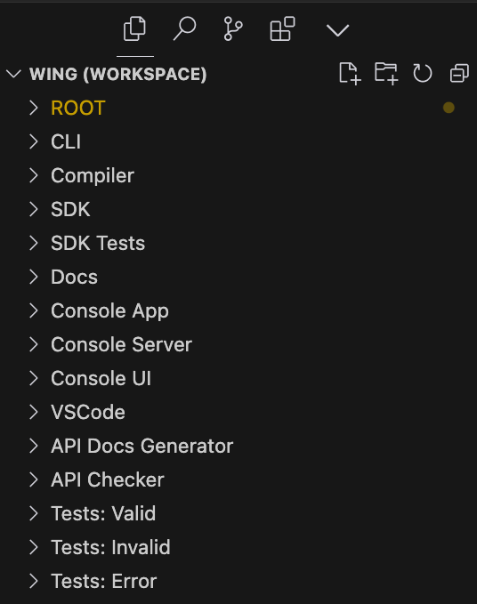

# Generate-Workspace CLI

The `generate-workspace` CLI is a tool that generates a Visual Studio Code [multi-root](https://code.visualstudio.com/docs/editor/multi-root-workspaces) workspace file based on the configuration of a pnpm [workspace](https://pnpm.io/workspaces).

## How it works

The CLI scans the pnpm workspace configuration and creates a `wing.code-workspace` file that Visual Studio Code can use to open multiple projects in the same window. This is particularly useful in a monorepo setup where you might have multiple packages that you want to work with at the same time.

The generated workspace file includes all the packages in the pnpm workspace, except for those specified in the `ignoreList` in `cli.ts`. The names of the packages in the workspace file are either their actual package names or the names specified in the `nameMapping` in `cli.ts`, if present.

## Usage

To use the `generate-workspace` CLI, run the following command in your terminal in the this directory: `npx generate-workspace`

